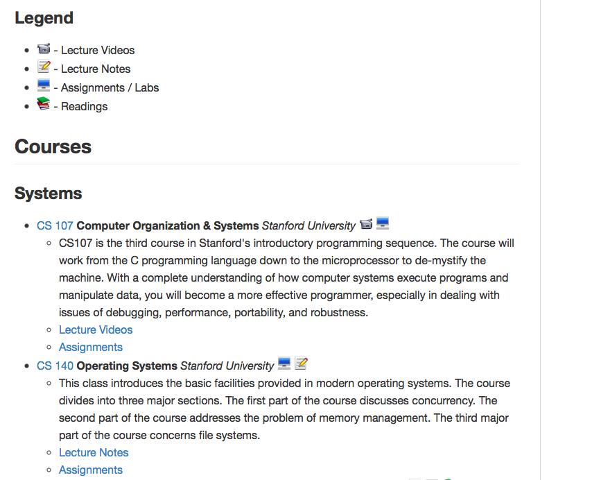

페이지 링크 : https://github.com/prakhar1989/awesome-courses

말 그대로 엄청나게 좋은 강의들을 모아 놓은 md 파일 프로젝트.

시간날 때 여기 있는 강의를 듣는 것 많으로도 많은 개발 무공이 갑자로 레벨업(?) 할 것만 같은 강의들로 가득차 있네요.

목차는 System, Programmin Language/Compilers, Algorithms, CS Theory,  Introduction CS, Machine Learning, Misc 순으로 전통적인 대학 강의 카테고리들을 생각해 볼때 Machine Learning 이 한 카테고리를 차지하고 있는 걸로 봐서는 머신러닝이 아주 핫한 모양이네요.

