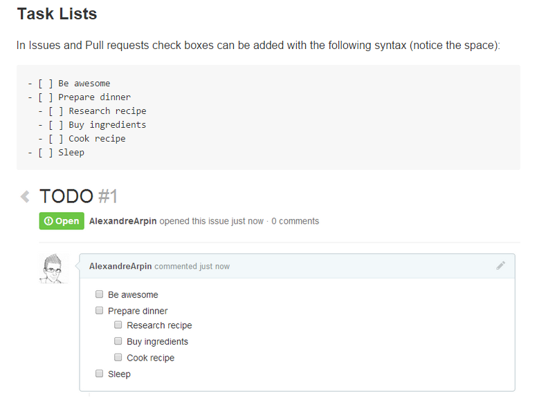

페이지 링크 : https://github.com/tiimgreen/github-cheat-sheet

5번째 아이템은 github-cheatsheet 이네요.

cheatsheet 이라고 하면 우리말로는 여러가지 표현법이 있겠으나 필살기 쯤으로 생각하시면 될 듯합니다.

깃헙! 이 정도는 사용해 줘야지 하는 정도로 접근하기에 좋은 아이템으로 보입니다.

저장소 클론 부터 브랜치 shorten url 서비스까지 자세하게 나와 있네요. 파일 볼때 라인만 강조하고 싶은 경우

예) https://github.com/rails/rails/blob/master/activemodel/lib/active_model.rb#L53-L60(이부분)

처럼 쓰면 되는 것도 있네요.

Task List를 다음과 같이 쓰는 것도 재미있네요.

