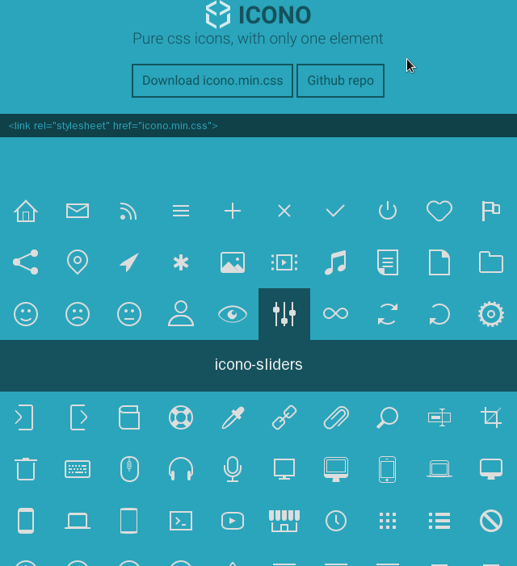

링크 : https://github.com/saeedalipoor/icono

forntawesome 은 다들 잘 알고 계실 거라고 생각합니다. ( http://fortawesome.github.io/Font-Awesome/)

CSS를 이용해 벡터 아이콘을 만드는 굉장히 좋은 라이브러리인데요.

이 icono의 경우는 external 리소스가 전혀 필요없는 pure CSS 만으로 이루어진 라이브러리라는 것을 강점으로 내세우고 있습니다.

저의 경우는 fontawesome을 주로 썼는데 불편함을 못느꼈는데, 아직은 비교해 봐서 어떤 부분이 더 좋은지는 확실히 잘 모르겠습니다.

결과물도 버전이 4.3 까지 올라간 fontawesome에 비해서는 다소 양적인 측면에서는 적어보입니다

