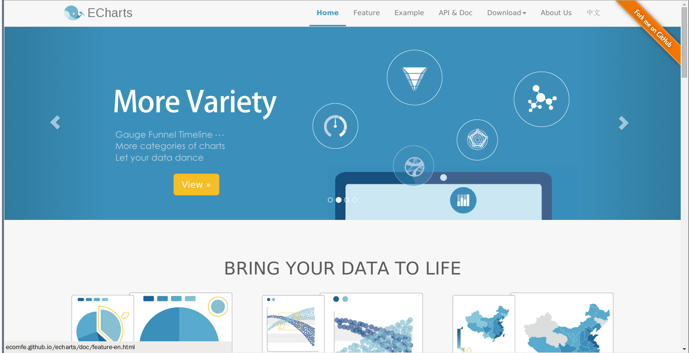

# echarts

링크 : https://github.com/ecomfe/echarts

echarts 는 중국의 바이두에서 만든 차트 오픈 소스입니다. 여러가지 많은 차트들을 다 지원하는게 인상적이지만 가장 놀라운 것은 브라우저 지원.(심지어 IE6 부터 최신 웹 브라우저까지 지원을 합니다.)

github page  자체는 중국어 페이지로 되어 있어서 내용 파악이 어려울텐데요.

http://ecomfe.github.io/echarts/index-en.html

이 링크를 타고 가면 전체적인 내용과 사용법들을 파악할 수 있습니다.

바이두의 저력을 엿볼 수 있는 오픈소스가 아닐까 합니다. 확실히 오픈 소스는 거대 기업들의 기술 자랑(?) 의 장이 되어 가는 것을 확인할 수 있습니다.

