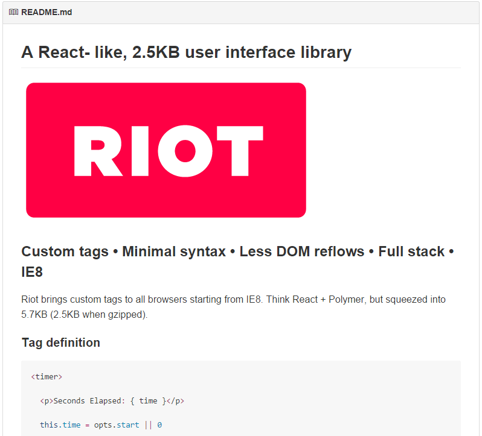

링크 :  https://github.com/muut/riotjs

최근  javascript 진영의 라이브러리는 예전 java의 커스텀 태그 처럼  html 커스텀 태그를 이용하는 형식의 프레임워크의 홍수를 이루고 있습니다. HTML5 가 가져다준 모던 웹 개발의 절대강자는 누가 될지 아직은 안갯속인데, 아무래도 우리나라에서는 AngularJS( https://angularjs.org/ ) 가 가장 많은 주목을 받고 있고, 최근은 Polymer( https://www.polymer-project.org/ ) 나 reactJS ( http://facebook.github.io/react/ ) 같은 라이브러리들이 눈에 띄기 시작했습니다.

하지만 이런 현상은 개발자들에게 어려움도 주기 시작했는데요.

일단 컨셉자체가 너무 어렵다는 점이 있을 수 있겠는데요. Angular 의 경우는 MVC 로써 자기의 자리를 잡아가는데 여러가지 컨셉을 들고 왔는데 Dependency Injection 부분과 Routing 이 초반 허들이라고 볼수 있을 거 같구요. Polymer 의 경우는 웹앱을 지향하고 있는데 웹컴포넌트라는 HTML5 표준에 대한 몇가지 이해를 전제 합니다. reactJS 는 아마 같이 소개가 될거 같으니 생략하겠습니다.

이런 춘추전국시대에 riot 은 "React- like 2.5k ui library" 를 표방하고 있습니다.

자기들은 React + Polymer 인데 5.7k 이고 gzip하면 2.5k 용량의 경량 라이브러리 라는군요.

http://www.robertwpearce.com/blog/riotjs-example/
를 보면 탭 예제들을 살펴볼 수 있습니다.

폴리머나 react 처럼 미려한 예제들은 볼 수는 없었지만, 커스텀 태그를 쓰는 것과 Virtual DOM, full stack  등의 이점을 생각해보면 단순함을 좋아하는 개발자라면 한번 들여다 보는 것도 괜찮을 거 같습니다.
게다가 커스텀 태그 컴파일에 관심이 있는 사람이라면, 5.7k 소스를 통해 커스텀 태그 컴파일 패턴을 배워보는 것도 괜찮아 보인다고 생각합니다.

심플함 때문인지 AngularJS 라던지 meteor 등과의 integration 에 대한 리소스들의 링크들이 얽혀 있는게 인상적입니다.

(실제로 AngularJS 와 폴리머의 integration 은 한참동안 arguement 가 있었던 부분이긴 한데요. 둘다 너무 많은 걸 제공하는 라이브러리라서 그런게 아닌가 생각해 본다면, riot 이 좀더 발전한다면 괜찮은 모습이 될 거라는 생각도 듭니다.)

