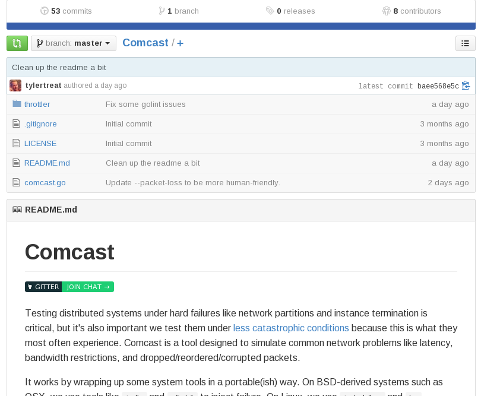

링크 : https://github.com/tylertreat/Comcast

Comcast 는 일반적으로 네트워크단에서 발생하는 지연, 대역제한, 패킷 손실같은 문제들을 시뮬레이션 해 볼 수 있게 디자인한 툴입니다.

golang으로 되어 있구요.

$ go get github.com/tylertreat/comcast
와 같은 명령어를 통해서 소스를 가져올 수 있습니다.

go 디렉토리($USER_HOME/go) 밑의 bin/ 디렉토리에 comcast 가 설치되는 걸 확인할 수가 있었고,

$ comcast --device=eth0 --latency=250 --target-bw=1000 --default-bw=1000000 --packet-loss=10%

250ms 의 응답지연과 대역폭은 1Mbps, 패킷 손실률은 10% 정도 로 주고 실행해 보았는데

약간의 문제가 있는지 CentOS6.5 기반에서는 제대로 작동하지 않아 보입니다.

