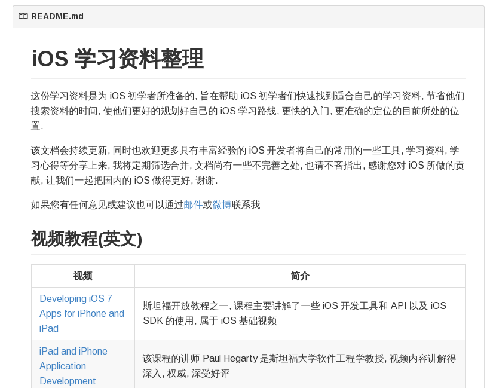

# trip-to-iOS

링크 : https://github.com/Aufree/trip-to-iOS

이 프로젝트는 같이 소개하고 있는 awesome-android-ui(https://github.com/wasabeef/awesome-android-ui ) 와 상당히 비슷합니다.

Readme.md 파일 안에 iOS 개발할 때 읽어야 할 문서들을 상세히 잘 기술해 놓고 있습니다. 중국어로 되어 있지만 반 정도는 영어로 된 부분을 링크 하고 있어서 읽어 내려가는 것도 괜찮을 거 같고, 여기에 있는 걸 번역만 해도 값지겠다는 생각을 해 봅니다.

깃헙 트렌드를 작성하면서 벌써 중국어로 된 깃헙 프로젝트가 두개라는 사실을 볼때에 SW 시장도 중국이 참 강하다는 생각을 지울 수가 없네요

