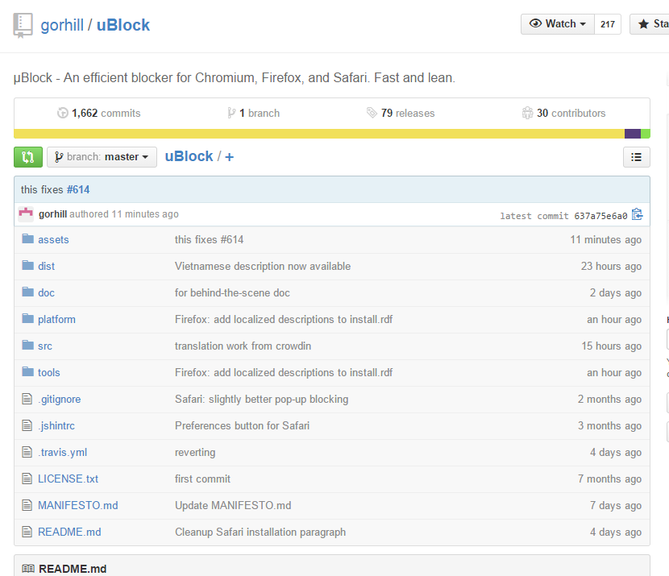

# 18. µBlock

페이지 링크: https://github.com/gorhill/uBlock

사용 언어: JavaScript

이것도 지난주에 소개되었던 프로젝트입니다. 

--- 지난 주 ---

다양한 브라우저의 add-on 기능을 block 해 주는 오픈소스입니다. Chromium, Firefox, Safari 등을 지원하고 있구요

최근 여러가지 이슈들로 ad-blocker 등이 고소를 당하느니 마느니 얘기가 많은데, 이를 의식한 듯. Philosophy 라는 항목을 할애해서 uBlock은 광고를 막는게 아니다라고 선언을 합니다.
물론, Adblock plus filter Syntax 를 사용해 광고를 막을 수 있다는 친절한 얘기가 더해져 있는 것은 유머일겁니다.

어쨌든 여러가지 브라우저의 add-on 기능을 차단해 실제 사용자에게 훨씬 좋은 인터넷 환경을 제공한다고 하니 한번 사용해 보는 것도 괜찮아 보입니다.

