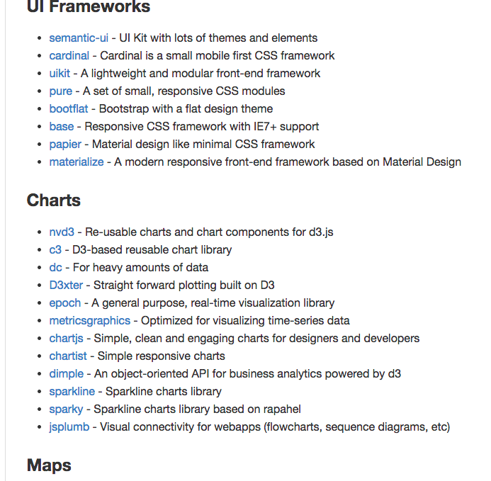

# Frontend stuff

페이지 링크 : https://github.com/moklick/frontend-stuff

이 프로젝트 또한 프로젝트 모임집 같은 프로젝트인데요, 특별히 프론트엔드 개발 프레임 워크들을 다루고 있습니다.
(Javascript에 집중하고 있다는 얘기를 하고 있습니다.)

UI framework 들을 살펴보면 semantic-ui 부터 materialize 까지 작성자가 찾은 UI 프레임 워크들을 소개하고 있습니다.

재미있는 것은 제가 이 프로젝트를 보면서 아래와 같이 Map카테고리에 Openlayers3를 추가해 달라고 했더니 금새 달렸습니다.
여러분들도 좋아하시는 프레임 워크들을 추천해 보는 것은 어떨까요?

차트들은 상당히 일목요연하게 잘 정리되어 있네요.

