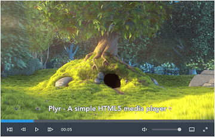

# paz

페이지 링크 : https://github.com/yldio/paz

Continuous deployment production environments, built on Docker, CoreOS, etcd and fleet.

Paz is an in-house service platform with a PaaS-like workflow.

html5 video

plyr

plyr는 video 태그만큼 간단하게 이용가능합니다. 또한 제공해주는 option 과 API등을 사용해 
다양한 기능들을 손쉽게 구현할 수 있습니다. 때문에 제어를 위해 따로 개발에 많은 공을 들이지 않아도 됩니다.

다만, 항상 말썽꾸러기인 IE는 10부터 부분적인 기능만 사용 가능합니다. 

미디어 서비스 제공을 위한 플레이어를 고민 중이시라면, plyr 사용을 고려해보시기 바랍니다.

