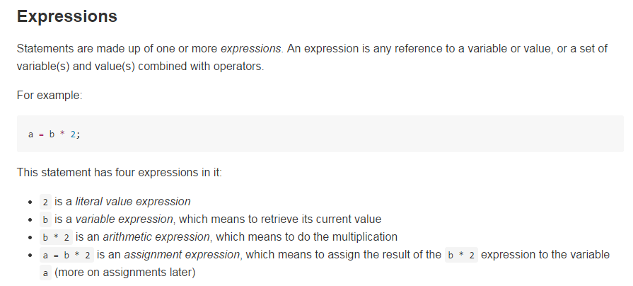

# You-Dont-Know-JS

페이지 링크 : https://github.com/getify/You-Dont-Know-JS

2번째 소개해드릴 금주의 Trend는 어떤 특정 기술이나 파일이 아니라 그냥 '책'입니다.  
제목에서 알 수 있듯이 Javascript에 대한 책인데요.

Chapter 1의 내용을 잠깐 살펴보니 프로그래밍 언어에 대한 개론부터 시작해서  
자바스크립트에 대한 내용들이 담겨있습니다.  
한 줄, 한 줄 코드를 적고 변수 하나하나의 의미까지 분석을 해놓았네요.

이러한 책의 내용을 오픈한다는게 참 쉬운일이 아닌데요,  
덕분에 Git 특유의 '공유'를 살려서 함께 틀린 부분을 고치고 알리고픈 지식을 더한다면 정말 좋을 것 같습니다.  

Javascript를 기초부터 다시 한번 보고싶다! 라고 생각하시는 분들,  
나만이 알고 있는 Javascript 비법을 가르쳐 주고싶다! 라는 분들, 여기로 모이세요.  
