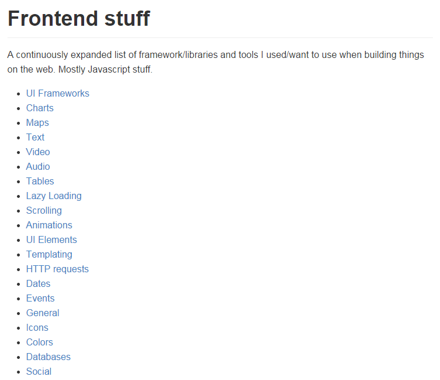
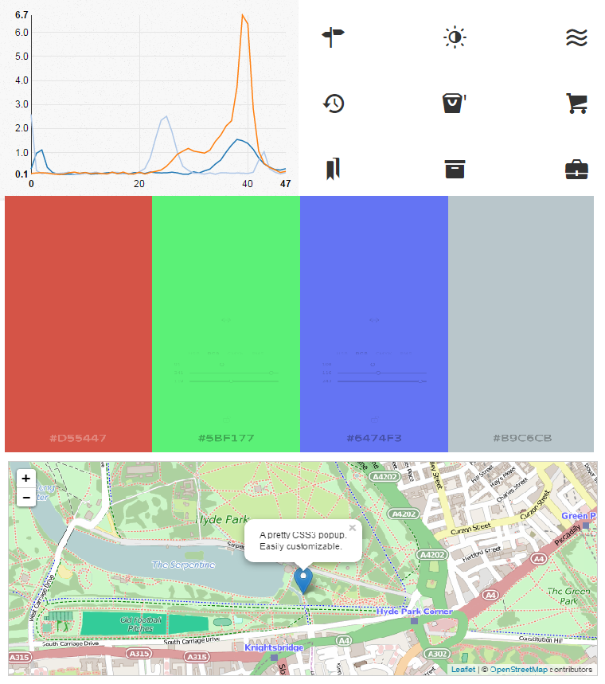
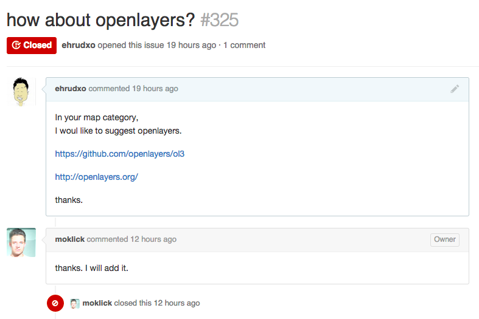

# frontend-stuff

페이지 링크 : https://github.com/moklick/frontend-stuff

------ 지난 주 ------

연이은 꽃샘추위에 옷깃을 여미게 되는 3월의 첫번째 Trend는 frontend-stuff 입니다.

Web Application을 개발하다가 이런 Front Layer가 있으면 좋겠다.  
차트를 넣고 싶은데 내 미적감각에 의심을 가지셨던 적 없으신가요.  
이 색 참 이쁜데 RGB가 어떻게 되지..?  
좀 아기자기하고 이쁜 아이콘 모듬이 없을까??  

위와 같은 생각을 해보신 분이라면 이 Trend를 주목해주세요.  
(설마 Web 개발하시면서 한 번도 저런 생각 안해봤다고 하시진 않겠죠..ㅎㅎㅎ)  

Fronted Layer에서 유용하게 쓰일법한 컨텐츠들을  
Section 별로 분류하고 정리해두었답니다.  
대부분의 컨테츠들이 Javascript로 만들어진 것들이라 좀 더 이해하기 편하실겁니다.  

--- 지난 주 ---

이 프로젝트 또한 프로젝트 모임집 같은 프로젝트인데요, 특별히 프론트엔드 개발 프레임 워크들을 다루고 있습니다.
(Javascript에 집중하고 있다는 얘기를 하고 있습니다.)

UI framework 들을 살펴보면 semantic-ui 부터 materialize 까지 작성자가 찾은 UI 프레임 워크들을 소개하고 있습니다.

재미있는 것은 제가 이 프로젝트를 보면서 아래와 같이 Map카테고리에 Openlayers3를 추가해 달라고 했더니 금새 달렸습니다.
여러분들도 좋아하시는 프레임 워크들을 추천해 보는 것은 어떨까요?

차트들은 상당히 일목요연하게 잘 정리되어 있네요.

