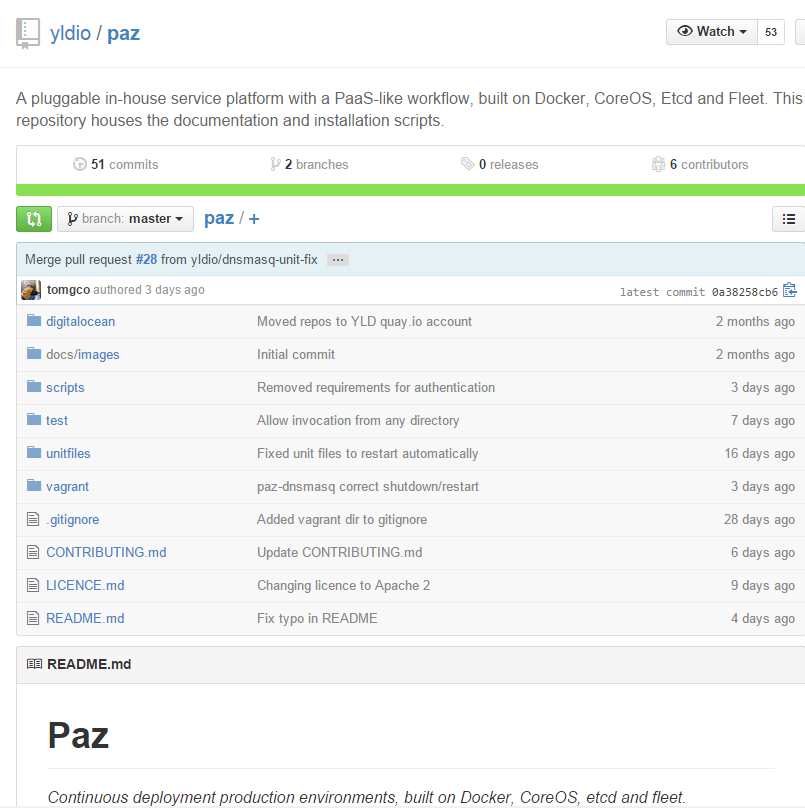

# paz

페이지 링크 : https://github.com/yldio/paz

------ 지난 주 ------

PaaS 와 같은 워크플로우를 가진 자체 서비스 플랫폼입니다. 
Docker, CoreOS, etcd and fleet 에서 사용되는 Continuous deployment production environments 라고 설명이 되어있습니다. 

어디서나 접속할 수 있는 개인 PaaS와 같이 사용 할 수 있는 무료 오픈 소스입니다. 
Dokku와 같은  a clustered/multi-host로 사용할 수 있고, Node.js로 작성이 되어있습니다. 
호스팅 서비스나, 완성된 엔터프라이즈급/ 오케스트레이션 솔루션은 아닙니다. 

이쁘고 사용하기 쉬운 웹 프론트엔드 UI를 갖추어 사용자의 서비스와 클러스터의 상태를 관리하기 쉽게 되어있습니다. 
그외에 스케줄러, 오케스트레이터, HAProxy나 모니터링/로깅등 다양한 기능을 제공합니다. 

이 저장소에는 문서(설치 및 사용법/ 테스트방법)들과 설치 스크립트가 저장되어 있으니 
어렵지 않게 따라해 볼 수 있을 것입니다. 

PAZ

