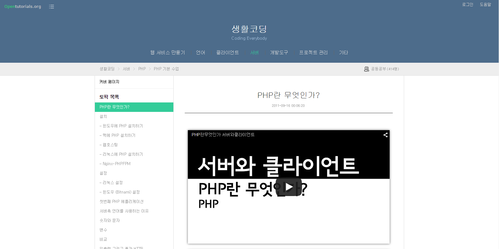

# php-must-watch

페이지 링크 : https://github.com/phptodayorg/php-must-watch

PHP(Hypertext Preprocessor)는 웹프로그래밍을 위해 생성되고 만들어진 언어로, 웹프로그래밍을 위한 높은 생산성을 제공하는 언어입니다. 특히 설치형 웹어플리케이션에서 많이 사용된다고 합니다.

php-must-watch는 PHP의 공부하기 위해 꼭 필요한!!! 영상의 링크를 모아 높은 markdown 파일입니다. PHP 개발자라면 입문자부터 고급개발자까지 이 문서를 참조하면 아주 유용할 것 같습니다.

영어라는 점이 PHP 공부에 발목을 잡는다라고 생각하신다면 생활코딩 사이트를 추천합니다. 설치와 설정 그리고 기본문법에 대한 부분을 동영상과 예제로 잘 설명해 놓았습니다.

* [**생활코딩**](https://opentutorials.org/course/62) - egoing

아래는 php-must-watch의 READ-ME 파일의 일부입니다.

1. 기본(basic)
2. 일반(general
3. 아키텍처와 디자인(architecture and design)
4. 성능과 규모(Performance and Scalability)
5. 보안(Security)
6. 테스팅(Testing)
7. 프레임워크(Frameworks
8. 기타(Others)
9. 고급(Advanced)

컨퍼런스와 비디오 자료 리스트입니다. [js-must-watch](https://github.com/bolshchikov/js-must-watch)에서 인사이트를 얻어 만들었습니다.

좋은 생각이 있다면 제안이나 컨티르뷰션 환영이고요, 컨트리뷰션 하기 전에 [contributing guidelines](CONTRIBUTING.md)를 읽어주세요.
