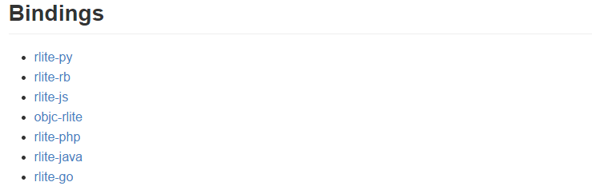

# rlite

페이지 링크 : https://github.com/seppo0010/rlite

sql의 내장 db인 sqlite처럼 redis의 내장 db인 rlite입니다.
독립적으로 동작하며, 서버나 환경설정이 따로 필요 없는 데이터베이스 엔진입니다.

Use Case들을 보니 redis가 사용되는 곳이면 사용 가능한 것 같습니다.
rlite의 저장방식으로는 redis의 rdb나 aof 방식이 아니라 rilte 고유의 방식을 사용합니다. 랜덤액세스가 아니고 전체 데이터를 읽어서 접근하는 방식을 사용하는 것 같네요.

rlite는 c로 되어 있는데, seppo0010님이 친절하게 다양한 버전으로 github에 올려 놓으셨습니다. redis를 사용한다면 필요한 버전으로 pull 받아서 사용하기에 편리할 듯 합니다.

