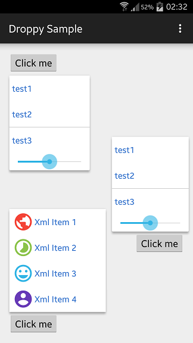

# Droppy

- 페이지 링크: [https://github.com/shehabic/Droppy](https://github.com/shehabic/Droppy)

Droppy는 커스터마이징이 가능한 안드로이드용 drop-down menu 입니다. 
많이 들어보신 jquery drop-down menu인 droppy의 이름을 따라 지은 것 같습니다.
Droppy는 안드로이드 native PopupMenu만으로는 표현하기 어려웠던 icon과 text를 섞거나 구분선을 끼어 넣는 등 다양한 방법으로 커스터마이징이 가능합니다. 

색다른 메뉴를 원하신다면 Droppy를 사용해보시기 바랍니다.

