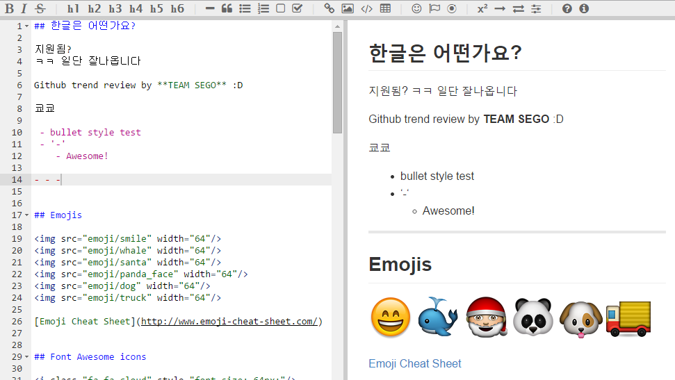

# markdown-plus

- 페이지 링크: https://github.com/tylingsoft/markdown-plus

빠르고 작성이 쉬운 편이라 마크다운을 많이 이용하시죠?

마크다운 에디터는 운영체제 별로 워낙 다양하게 제공되기도 하고, 사용하시는 분의 취향을 많이 탈 것 같습니다.

마크다운 전용 에디터를 이용하시는 분도 있을 것 같고, Atom이나 Sublime text 같은 프로그램을 이용하는 분도 있을 것 같네요.

Tylerlong 이라는 중국 개발자가 작성한 markdown plus 입니다. (굳이 사진도 긁어옴..) 실시간 미리보기 확인도 가능하고 가볍게 사용하기 참 좋은 것 같습니다 ^^

- 온라인 데모: https://tylingsoft.github.io/markdown-plus-demo/

좋아보이나요?

