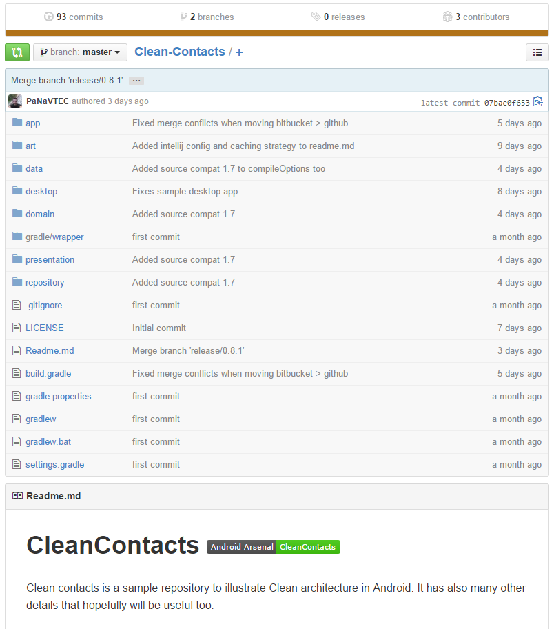

# Clean-Contacts

- 페이지 링크: https://github.com/PaNaVTEC/Clean-Contacts

`Clean-Contacts`는 안드로이드에서 Clean 아키텍처를 샘플 리파지토리입니다. 그리고 더 많은 유용한 정보도 있습니다.  

이 프로젝트는 5가지 모듈(App, Presentation, Domain, Repository, Data)로 나눠져 있습니다.  
MVP를 비롯해서 리파지토리를 구성하는데 필요한 모듈들과 유용한 기능들 (예를 들어, 리파지토리를 최소화시키거나 abstraction 사용 등)이 있으니 리파지토리에 대한 이슈가 있으신 분들은 참고하시면 좋을 것 같습니다.

다음 그림에 Desktop App sharing common module Sample화면이 있습니다.    
IntelliJ를 사용하시면 실행시켜 볼 수 있습니다. 

License
=====

    Copyright 2015 Christian Panadero Martinez

    Licensed under the Apache License, Version 2.0 (the "License");
    you may not use this file except in compliance with the License.
    You may obtain a copy of the License at

       http://www.apache.org/licenses/LICENSE-2.0

    Unless required by applicable law or agreed to in writing, software
    distributed under the License is distributed on an "AS IS" BASIS,
    WITHOUT WARRANTIES OR CONDITIONS OF ANY KIND, either express or implied.
    See the License for the specific language governing permissions and
    limitations under the License.