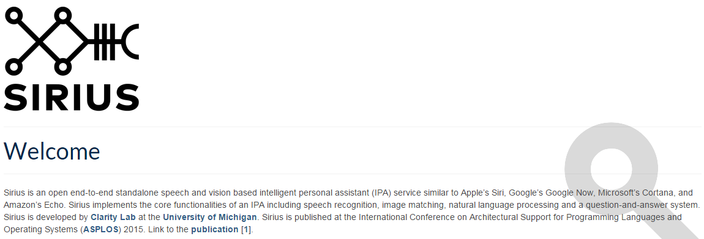

sirius
==================================================
- 페이지 링크: https://github.com/jhauswald/sirius

애플의 시리, 구글의 구글 나우, MS의 코타나, 아마존의 에코.

이 단어들이 나열될 때 여러분은 무슨 생각을 하셨나요? 개인비서라는 말을 떠 올리셨을 꺼라고 추측이 됩니다.
지금 소개하는 이 프로젝트는 이 개인비서(Intelligent Personal Assistant)를 오픈 소스화 하자는 프로젝트입니다.
미시간 대학의 Clarity Lab 에서 추진하고 있구요

관련된 동영상은 https://youtu.be/JfblLR6Xx2k 에서 확인이 가능합니다.

Speech and Vision Based IPA 라는 말을 봤을 때에 말로 쿼리를 하는 기본 기능 외에 이미지나 동영상을 통한 검색 쿼리도 제공할
것으로 보여집니다.

