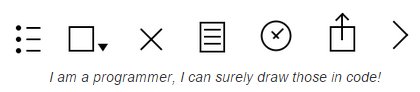
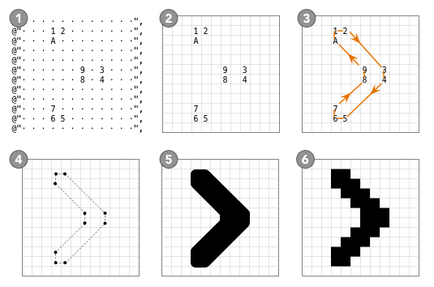
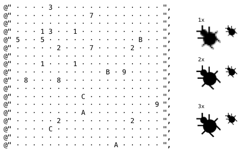

ASCIImage
============
- 페이지 링크: https://github.com/cparnot/ASCIImage

- 사용언어 : Objective-c

이번에 소개해드릴 깃헙 트랜드는 ASCIImage입니다. 코드만으로 아주 손쉽게 UIImage, NSImage를 만들어 사용 할 수 있는데요.



이와 같은 이미지를 코드만으로 만들 수 있다니 참 신기하네요.

```1 ` ` ` ` ` ` ` ` 1``` 이런식으로 표현을 해주면 1에서 1까지 연결되는 선으로
출력이 되며, 1~9 - A~Z - a~z 순으로 도형이 그려집니다.
직선 뿐만 아니라 원까지 표현 할 수 있어 다양한 Image를 만들 수 있습니다.




그리는 방법과 원리에 대해서는 [Replacing Photoshop With NSString](http://cocoamine.net/blog/2015/03/20/replacing-photoshop-with-nsstring/) 블로그에 자세히 설명되어 있습니다. 



이제 막 시작하는 프로젝트 이기에 앞으로 어떤식으로 진행될지는 두고 봐야할 것 같네요.