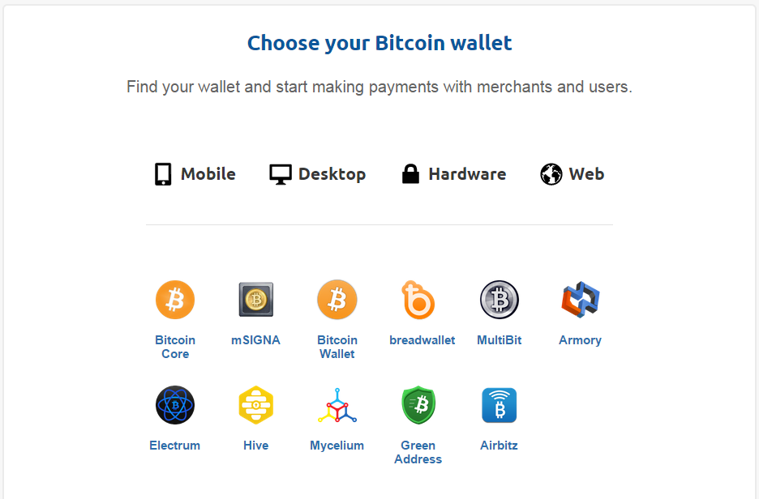

Electrum - lightweight Bitcoin client
======================================
- 페이지링크 : https://github.com/spesmilo/electrum

Electrum을 알기 위해서는 비트코인을 알아야 합니다.

>비트코인(Bitcoin)은 2009년 나카모토 사토시(영어: Nakamoto Satoshi)가 만든 디지털 통화로, 통화를 발행하고 관리하는 중앙 장치가 존재하지 않는 구조를 가지고 있다. 대신, 비트코인의 거래는 P2P 기반 분산 데이터베이스에 의해 이루어지며, 공개 키 암호 방식 기반으로 거래를 수행한다. 비트코인은 공개성을 가지고 있다. 비트코인은 지갑 파일의 형태로 저장되며, 이 지갑에는 각각의 고유 주소가 부여되며, 그 주소를 기반으로 비트코인의 거래가 이루어진다. 비트코인은 1998년 웨이따이가 사이버펑크 메일링 리스트에 올린 암호통화(cryptocurrency)란 구상을 최초로 구현한 것 중의 하나이다

가상화폐로 2014년 상당한 반향을 일으켰었죠.

비트 코인에 대한 조금 더 깊고 재미있는 이야기를 읽어볼까요?

[조성문의 실리콘밸리 이야기 - 비트코인 경제학](http://sungmooncho.com/2013/12/02/bitcoin/)
>위 알고리즘은 그렇다 치고, 아무리 생각해도 잘 이해되지 않는 의문이 있을 것이다. 실체도 없는 컴퓨터 코드가 어떻게 해서 사람들이 기꺼이 돈을 주고 사고 싶어하는 ‘가치를 지닌 물건’이 되는가? 온라인 게임 아이템을 생각하면 이해가 쉬울 것 같다. 지난 10월, 리니지에서 ‘진명황의 집행검’이라는 아이템을 인첸트(inchant)하려다 실패해서 리니지를 상대로 아이템 복구 소송을 냈다가 패소한 사례가 있었다. 이 재판의 쟁점이 되었던 ‘진명황의 집행검’은 시가가 무려 3천만원이다. 게임 아이템이 뭐길래 시가 3천만원이 되는가? 그 이유는 ‘희소성’, 그리고 ‘시간과 노력’에 있다. 게임 내에서 이 아이템을 만들기 위해서는 무수히 많은 시간을 써야 하고, 거기에 운도 따라야 한다. 사람의 시간이 들어가서 쓸모 있는 무언가가 만들어지면, 그것이 무엇이든간에 어느 정도의 가치를 지닌다.비트코인도 마찬가지이다. 다만 차이는, 리니지에서는 사람이 노가다를 해서 아이템을 획득해야 하지만, 비트코인은 사람 대신 ‘기계가 노가다를 해서’ 코인을 획득해야 한다는 것이다. 기계는 공짜가 아니다. 몇 천 달러를 주고 사야 하고, 전기도 많이 든다. 이렇게 ‘투자’를 해야만 비트코인을 얻을 수 있기 때문에 그 결과물은 일정 이상의 가치를 지닌다. 그 가치가 10달러가 맞는지 1000달러가 맞는지에 대한 논의는 별개로 하고, 시간이 지날수록 더 비트코인을 얻기 힘들고, 더 고가의 장비가 필요하도록 설계되어 있기 때문에 가치가 상승할 내재적 가능성이 있다. 그 때문에 ‘마이너(miner)’들은 하루라도 빨리 비트코인을 얻으려고 혈안이 되어 있다.

비트코인 홈페이지에 들어가보면 사용할 wallet을 고르라고 나옵니다.

[비트코인 - 사용할 wallet을 고르세요](https://bitcoin.org/en/choose-your-wallet)

이 중에 하나로 Electrum 이 소개가 되어 있고,  desktop 클라이언트 중에 하나이군요.

python 기반으로 만들어져 있고 흥미롭기는 한데

이 프로젝트 자체보다 비트코인 자체에 더욱 흥미가 생기는 하루입니다.

