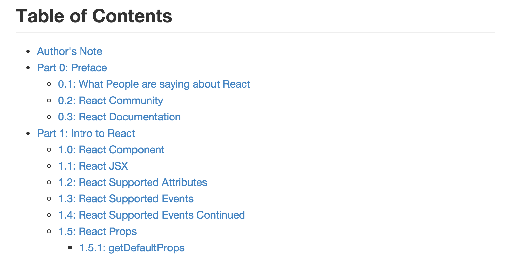

react-primer-draft
==================================================
- 페이지 링크: https://github.com/mikechau/react-primer-draft

facebook의 react!!! 요즘 가장 핫한 프로젝트 중 하나죠. 

이번에 소개해 드릴 깃헙 트랜드는 Single-Page App을 만들기 위한 입문서!!!
react-primer-draft 입니다.

현재는 react에 대한 intro 부분까지 작성된 상태이며, Harmony aka ES6 aka ES2015 부분은 작성 중이라고 합니다. 저도 react에 대해 관심은 엄청 많아진 상태이지만, 시작하려고 하니 진입장벽이 조금 높다는 느낌을 받았는데요. 
react-primer-draft는 react에 대한 설명과 관련 링크들, 셈플 코드들이 잘 정리가 되어 있어 저같은 초보자도 쉽게 따라 해볼 수 있고, 따로 자료들을 찾아보기 위한 구글링에 따로 시간을 쓰지 않아서 좋네요.

추후에는 번역 등으로 contribution 할 수 있을 것 같습니다. 

react에 대해 배우고 싶다면, react-primer-draft 정독 추천 드립니다.

