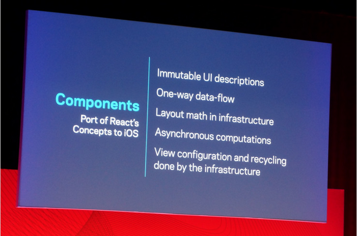
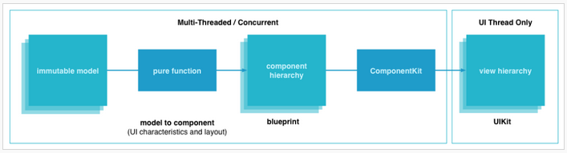

ComponentKit
=====================================================================
- 페이지 링크: https://github.com/facebook/componentkit
- 사용언어: Objective-C++

이번 소개해드릴 깃헙 트랜드는 지난 3월 25일 [F8 2015](https://fbf8.com)에서 소개된 [Componentkit: Functional and declarative UI on iOS](http://componentkit.org) 입니다.

이 프로젝트는 react에서 영감을 받아 개발하게된 ios 용 UI framework이라고 합니다.

ComponentKit는 immutable models에서 단방향 데이터 흐름에 초점을 맞춰 UI를 구축하는 기능적이고 선언적인 접근 방식을 사용한다고 하는데요. 말이 조금 어렵네요.

데모를 원하시는 분께서는 [ComponetKit Getting Started](http://componentkit.org/docs/getting-started.html)에서 한번 따라해보시기 바랍니다.

요즘 대세가 된 [react](https://facebook.github.io/react/)처럼 앞으로 ios 개발에서 어떤 위치가 될지 궁금하네요.