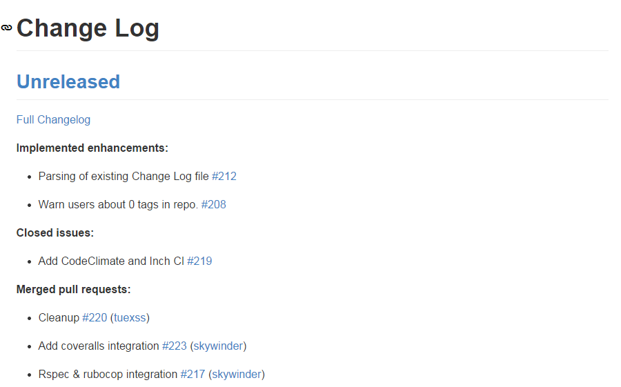

github-changelog-generator
==================================================
- 페이지 링크: https://github.com/skywinder/github-changelog-generator

- 사용언어 : Ruby

루비를 이용하여 만들어진 github 상의 activity change log generator입니다.

issue의 상태 변화, merge request, tag 정보 변경에 대한 정보가 CHANGELOG.md 라는 이름으로 markdown 형식으로 저장되게 됩니다.

기본적인 log 기록의 규칙은 다음 내용을 따라 작성되었다고 하네요. [참조](http://keepachangelog.com)

