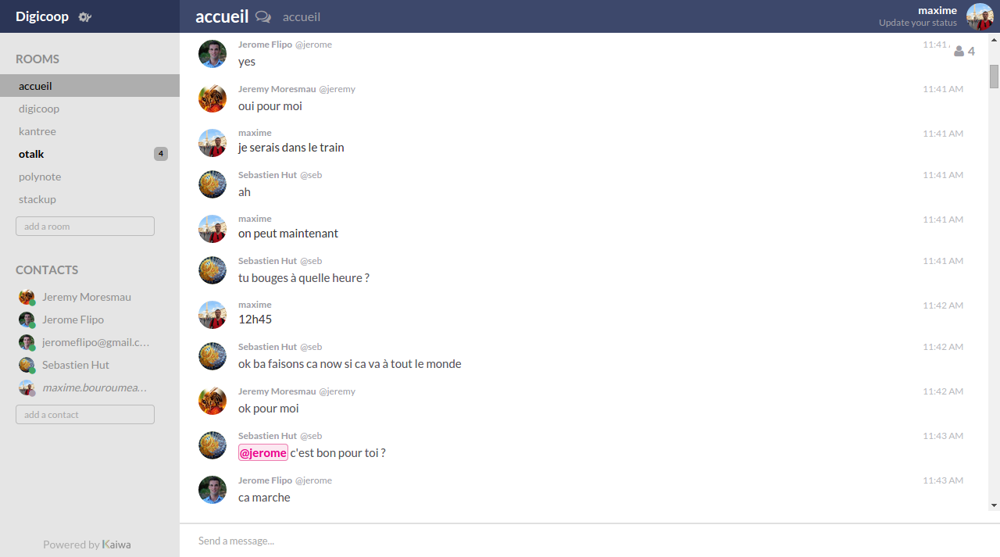

# kaiwa

 - 페이지 링크: [kaiwa](https://github.com/digicoop/kaiwa)

XMPP(Extensible Messaging and Presence Protocol) 프로토콜이 어쩌면 생소하실 수도 있겠는데요.
Web RTC(Real Time Communication)는 많이 들어본 적이 있으실 겁니다. 요즘 Web에서의 화두 중의 하나로 실시간성을 들 수 있습니다. HTML5의 Websocket이나 Web RTC처럼 Web의 실시간성을 목적으로 만든 기술은 아니지만, XMPP는 XMPP도 XML에 기반한 메시지 지향 프로토콜입니다.

kaiwa는 이 XMPP 프로토콜을 이용해 web browser에서 메시지를 주고받을 수 있도록 한 web client 프로젝트입니다.
해당 프로젝트는 [Otalk](https://github.com/otalk)라는 프로젝트를 Fork하여 커스터마이징 하였구요. 해당 프로젝트를 재대로 구동시키기 위해서는,
XMPP서버를 구동해야 합니다. 서버 프로젝트 [kaiwa-server](https://github.com/digicoop/kaiwa-server)도 깃허브에 같이 제공되고 있네요.
기존에 어느정도 완성도가 있는 프로젝트를 기반으로 커스터마이징한 프로젝트이다보니 꽤 많은 XMPP 표준을 준수하며, 높은 완성도를 보여주고 있습니다.
웹 브라우저에서 메신저 서비스를 제공해야 하는 분들이라면 관심을 가지셔도 될만한 프로젝트입니다.
