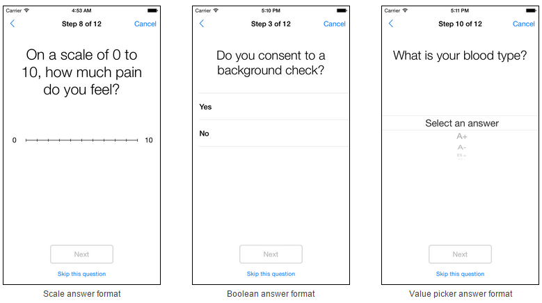

# ResearchKit

 - 페이지 링크: [ResearchKit](https://github.com/ResearchKit/ResearchKit)
 - 사용언어 : Objective-C

이번에 소개할 깃헙 트랜드는 ResearchKit Framework 입니다.
ResearchKit Framework은 의료 연구를 위한 목적으로 만들어 졌으며 설문, 동의, 활동에 대한 조사를 위한 기능이 제공됩니다. 이러한 기능들을 이용해 다른 분야에서도 연구를 목적으로 사용 가능하다고 생각됩니다.
조만간 안드로이드쪽에서도 비슷한 프로젝트가 나오지 않을까 라는 생각이 되네요.

