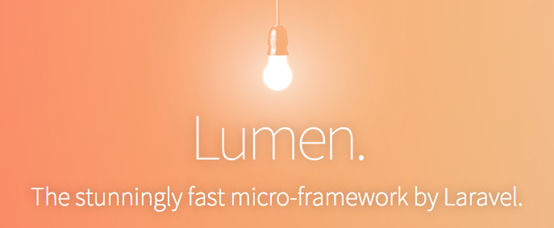

# lumen

 - 페이지 링크 : [lumen](https://github.com/laravel/lumen)
 - 사용언어 : PHP

이번에 소개해 드릴 깃헙 트랜드는 lumen 입니다.

lumen은 expressive, elegant한 구문의 엄청 빠른 PHP micro-framework 라고 하네요.
Laravel Framework이 micro-service에는 맞지 않는다고 생각되, Laravel API를 벤치마크해 제작하였다고 합니다.

PHP로 micro-service 개발에 대해 기획중이시라면, lumen framework 사용에 대해 고민해보시면 좋을 것 같네요.

더 자세한 내용을 알고 싶으시면 lumen을 소개한 아래 링크를 보시기 바랍니다.
[https://laravel-news.com/2015/04/lumen/](https://laravel-news.com/2015/04/lumen/)