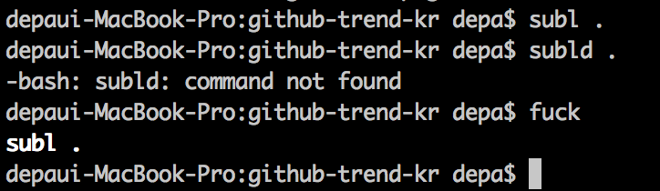

# thefuck

- 페이지 링크: [thefuck](https://github.com/nvbn/thefuck)
- 사용 언어: python

이번에 소개해드릴 깃헙 트랜드는 thefuck입니다.
저는 초보 개발자라서 종종 콘솔에 명령어 입력을 실수 하곤합니다.
최근에는 개발용으로 사용하고 있는 맥프로에 mongodb를 설치 후 실행을 시키는데 오류가 나더군요. 회사에서 업무용 노트북에서 mongodb를 사용했었기 때문에 잘 될꺼라고 생각했는데 실행이 잘 안되니 당화스러웠습니다. 옆에서 스티브가 sudo가 빠진걸 가르쳐줘서 잘 실행을 시켰었죠.
콘솔 명령어를 잘못 입력하는 경우가 종종있는 저와 같은 개발자에겐 the fuck은 정말 유용한 프로그램인 것 같습니다.



위 이미지는 thefuck을 테스트 해본 것입니다. sublime text를 실행시키기 위해서 명령어를 입력했는데 입력을 실수 했고, 실수 후 fuck을 입력하니 올바른 명령어가 출력되면서 명령어 실행까지 해줍니다.

설치 방법은 python 설치 후 ```sudo pip install thefuck``` pip로 설치 할 수 있으며, 
.bashrc나 .bash_profile 파일에 alias를 적으면 됩니다.

그리고 개인적으로 Rule들을 만들어 사용할 수 있어, 나만의 fuck을 만들 수 있습니다.

리눅스나 OS X 사용자라면 꼭 설치해보시고 사용해보시기 바랍니다.