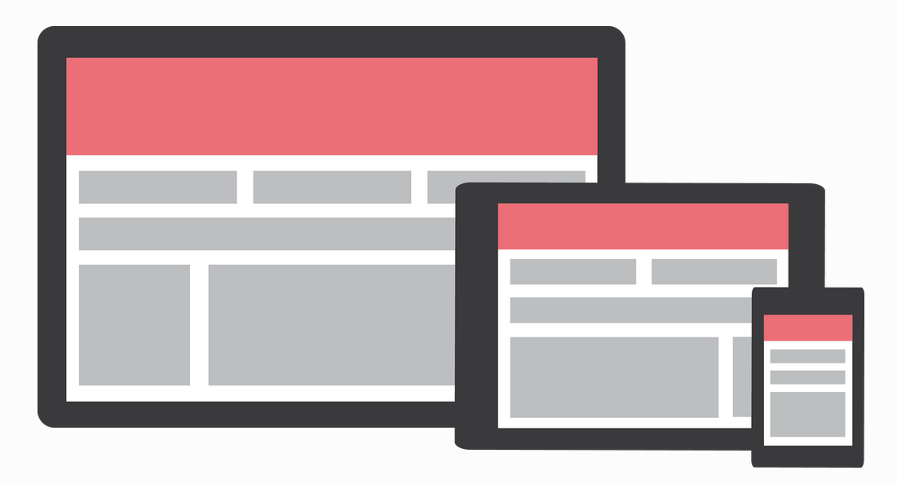

# Materialize

- 페이지 링크: [Materialize](https://github.com/Dogfalo/materialize)
- 사용 언어: css, javascript

이번에 소개해드릴 깃헙 트랜드는 [Materialize](http://materializecss.com/) 입니다.

이 프로젝트 이름에서 바로 감이 오시는 분들이 계실 건데요. Material Design을 기반으로 한 front-end ui framework입니다.

Material Design은 구글이 공개한 모바일과 데스크탑 그리고 그 외 다양한 디바이스들을 아우르는 하나의 일관된 디자인 가이드라인입니다.질감이 느껴지는 표면 (tactile surfaces) 과 대담하고 선명한 그래픽 디자인 (bold graphic design), 그리고 아름답고 직관적인 사용자 경험을 위한 자연스러운 애니메이션을 특징으로 한다고 하네요.

간단하게 사용을 해봤는데, Material Design용 bootstrap이라고 생각되네요.
지원하는 브라우져는 Chrome 35+, Firefox 31+, Safari 7+, IE 10+입니다. 참고하세요!

그리고 [super dev resources](http://superdevresources.com/material-design-web-ui-frameworks/)을 보면 Material Design 관련한 ui franemwork들이 소개 되어 있습니다. front-end framework을 어떤 걸로 사용할지 고민이시라면 들어가서 한번 살펴보시기 바랍니다.

