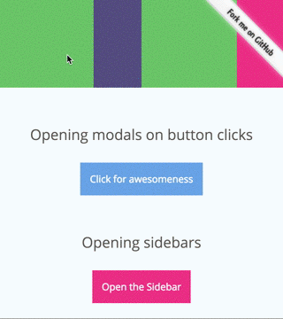

# cta.js

- 페이지 링크: [cta.js](https://github.com/chinchang/cta.js)
- 사용 언어: javascript

이번에 소개해 드릴 깃헙트랜드는 cta.js입니다. 
백문이 불여일견이라고 한번 [cta.js DEMO](http://kushagragour.in/lab/ctajs/)를 해보시죠!!



데모에서 해보신 것 처럼 cta.js는 element에 animation 효과를 주는 javascript 라이브러리 입니다.
앞에서 소개된 Materialize와 같은 Material Design에 cta.js가 결합이 된다면 아주 괜찮은 웹 페이지가 만들어 질 것 같습니다.


```
var e1 = document.querySelector('#js-source-element'),
    e2 = document.querySelector('#js-target-element');
var reverseAnimate = cta(e1, e2);

reverseAnimate();

```
이와 같이 source와 target element를 선언해 사용하면 되며, option을 통해 다양한 효과를 줄 수 있습니다.

크롬, 파이어폭스, 사파리 최신버젼에서 이용가능하며, 익숙하듯.. IE는 지원에 대해서는 언급이 없네요.