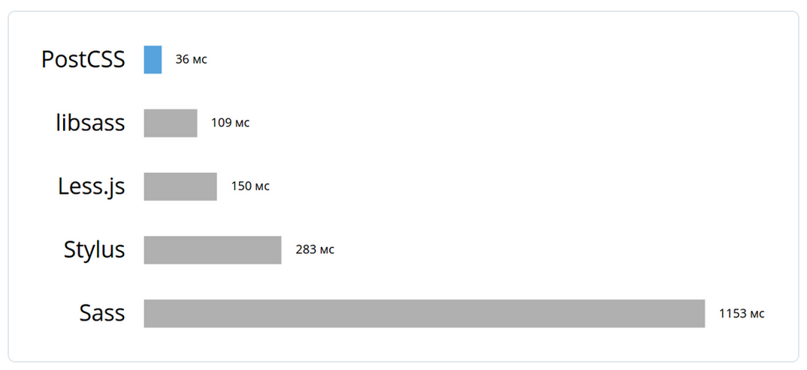

# postcss

- 페이지 링크: [postcss](https://github.com/postcss/postcss)

이번에 소개해드릴 깃헙트랜드는 postcss입니다.
postcss는 Sass나 Less와 같은 css preprocessor의 일종으로 생각하면 될 것 같고, 이미 구글과 트위터 등에서는 postcss를 사용하고 있다고 합니다.

처음엔 [TJ Holowaychuk이 rework](http://tjholowaychuk.tumblr.com/post/44267035203/modular-css-preprocessing-with-rework)라는 프로젝트로 시작했고, 여기서 더 발전된게 postcss라고 합니다.

성능은 앞선 preprocessor들 보다 3~30 정도 좋다고 하며, autoprefixer나 cssnext 등의 기능들을 사용할 수 있다고 하네요. [about-postcss](http://ai.github.io/about-postcss/en/)에 들어가시면 더 자세한 나용을 찾아 보실 수 있습니다.

그리고 [breaking-up-with-sass-postcss](http://benfrain.com/breaking-up-with-sass-postcss/) 블로그를 보시면 sass와 postcss를 비교하고, sass에서 postcss로 마이그래이션하는 과정들이 있으니 관심 있으시면 들어가셔서 보시기 바랍니다.

앞으로 Sass나 Less를 뛰어넘을지 관심있게 지켜봐야 할 것 같습니다.