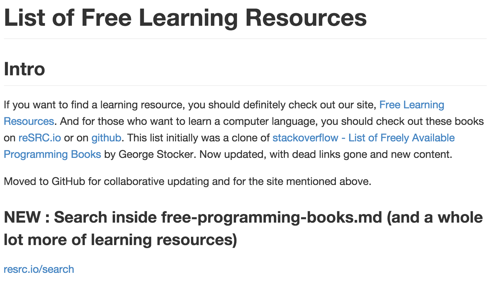

# free-programming-books
- 페이지링크: [free-programming-books](https://github.com/vhf/free-programming-books)

현재도 쇼팽, 라흐마니노프, 그리그 같은 작곡가들의 곡들이 기억되듯이 
우리의 코드도 언젠가 먼 훗날의 후배들과 함께 통신하기를 기원해봅니다.

그러기 위해서는 오픈소스 공유가 최고인거 같아요.   

내코드가 후대에 전달되는 그날까지 계속 참여해봅시다. 

--- 지난 주 ---

제가 생각하는 github의 최대 강점은 '공유'인데요.  
금주 Trend 02인 You-Don't-Know-JS와 더불어 이 Trend도 역시 공유의 힘이 돋보입니다.  

전 세계 개발자들이 모여서 지식을 공유하고 함께하는 자리에  
이 글을 보고 있는 당신이 없다니..? 굉장히 아쉬운 이야기가 아닐 수 없는데요.  
아직 늦지 않았습니다, 함께 참여해 보시죠 :)  

--- 지난 주 ---

이 프로젝트는 무료 프로그래밍 자료를 모아 놓은 것입니다.

처음 [stackoverflow - List of Freely Available Programming Books](http://stackoverflow.com/questions/194812/list-of-freely-available-programming-books/392926#392926)에서
George Stocker에 의해 최초 리스팅 되었고, 자료들이 점차 많아지면서 github로 옮겨 계속 업데이트 진행하고 있습니다.

또한 각국의 언어들로 해당 자료들에 대한 번역이 진행되고 있습니다. contributor만 무려 539명이네요.

이렇게 개발자들이 한데 모여 각자 가진 재능으로 프로젝트에 기여하는 문화가 github가 갖는 큰 강점 중 하나인 것 같습니다.

저도 free-programming-books에서 평소에 관심있던 언어에 대해 찾아보고, 번역으로 contribution 해야겠습니다.

프로그램 공부 또 번역에 관심있다면 같이 해보시죠.

