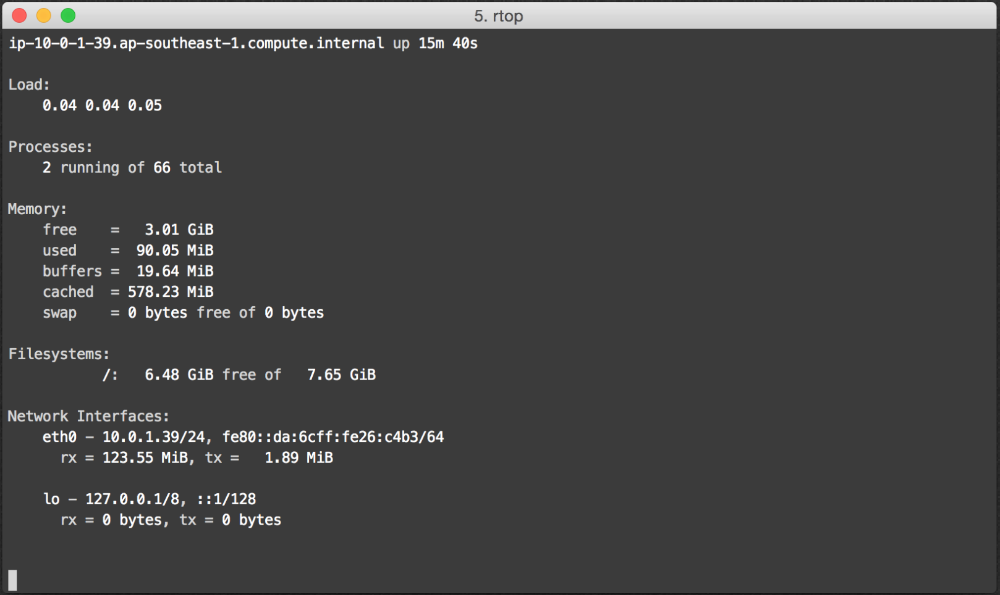
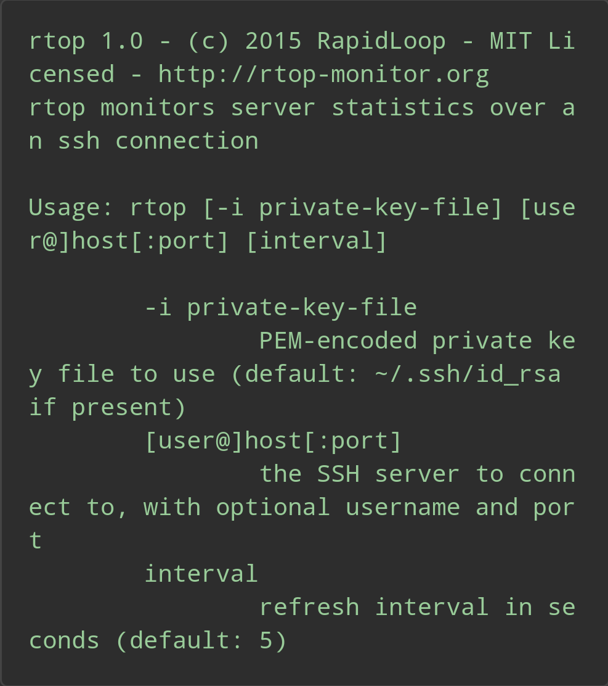
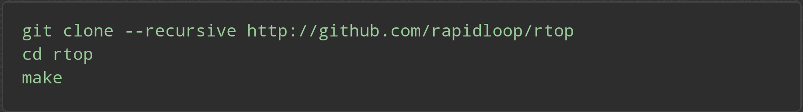

# rtop
- 페이지링크: [rtop](https://github.com/rapidloop/rtop)

SSH을 통해 원격 서버 모니터링 하는 툴로 
간편하지만 Linux 환경에서만 동작합니다. 
Window에서 테스팅은 아직 안해봤지만 Cygwin을 통해서는 될거 같다고 
공식사이트에서 그러더라고요. 

이런식으로 사용해요. 

비공개 키와 패스워드가 필요해요. 밑에 있는 방식으로 호출 할 수 있습니다. 

밑에 있는 방식으로 클론 하셔서 갖다 쓰시길 바랍니다. 

Go로 작성되었고 MIT 라이선스이니 주저 말고 사용하시길 바랍니다. 

