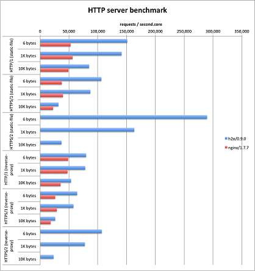

#H2O

페이지 링크 - https://github.com/h2o/h2o

오픈소스 HTTP 서버로 대표적인 프로젝트에 apache와 nginX가 있습니다. 아파치가 대중적으로 많이 쓰이고 nginX는 강력한 성능을 무기로 점유율을 높여가고 있지요. H2O는 2014년 말에 공개된 C기반의 새로운 HTTP 서버입니다. nginX보다 더 강력한 성능을 가졌다고 설명하고 있으며 벤치마크 결과를 확인해보면 아직 소스 버전이 1점대가 아님에도 불구하고 꽤 인상적인 성능을 보여주고 있습니다. 실제 필드에서 쓰인 사례가 늘어난다면, 향후 2-3년 내로 오픈소스 HTTP 서버에서 꽤 인기를 끌만한 프로젝트가 아닐까 생각이 됩니다.

