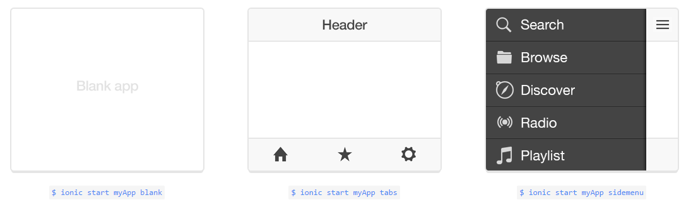

# ionic
 - 페이지 링크: https://github.com/driftyco/ionic


Ionic은 웹이나 하이브리드 앱 개발에 관심을 갖고 계셨던 분들이라면 이미 많이 들어보셨을, Angular JS 기반으로 만들어진 프론트 엔드 프레임워크 입니다. 원하시는 플랫폼(안드로이드/ios)으로 빌드가 가능합니다. 

기본적으로 sass 를 사용하고 있으며, 간단하게 UI를 html을 이용해서 개발하고, MVC 개발도 가능합니다. UI 컴포넌트들이 directive를 이용해 모듈화 되어있다고 생각하시면 됩니다.

codepen 에서 ionic으로 작성된 간단한 데모들 리스트를 제공하고 있어요.
* [데모](http://codepen.io/ionic/public-list)

우선 ionic을 설치하기 위해서는 Node.js가 설치 되어있어야 하고, 사용하시려면 물론 angular.js 에 대한 이해가 선행되어야 합니다.

명령어를 통해 cordova와 ionic을 설치하신 후, 

```bash
$ npm install -g cordova ionic
```

Ionic project를 생성하시면 됩니다. Optional template을 적용하여 샘플별로 앱을 생성해볼 수 있고요,

```bash
$ ionic start <projectname> <optional-template>
```



ionic serve 메시지를 입력하여 서버에서 돌려보시며 개발을 시작하시면 됩니다!