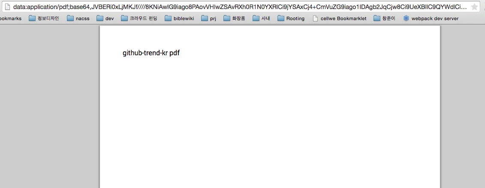

# pdfmake

 - 페이지 링크: https://github.com/bpampuch/pdfmake

 클라이언트, 서버 사이드 pdf 제작 툴입니다.

 ```
 bower install pdfmake
 ```

 를 통해 설치를 해 봤습니다. 우선 webpack,gulp 파일이 보이네요. 요즘 핫한 빌드툴이죠.

 설치 후에 아래와 같이 소스를 웹 페이지에 만들어보았습니다.

 ```
  <!doctype html>
  <html lang='en'>
  <head>
         <meta charset='utf-8'>
         <title>my first pdfmake example</title>
         <script src='pdfmake.min.js'></script>
         <script src='vfs_fonts.js'></script>
  </head>
  <body>
  hello, pdfmake
  <script>
  var docDefinition = { content: 'github-trend-kr pdf 만들기' };
  pdfMake.createPdf(docDefinition).open();
  </script>
  </body>
 ```

 결과는 다음과 같이 Awesome 한데! 한글이 안 찍혔네요

 

 인코딩 문제인 거 같은데 이 문제는 어떻게 풀어야 할 지 모르겠네요. 
