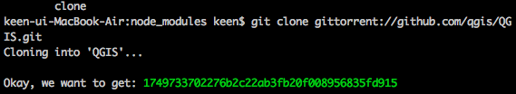

# GitTorrent

 - 페이지 링크: https://github.com/cjb/GitTorrent

 아이디어가 돋보이는 프로젝트입니다. git 저장소로 부터 데이타를 받는 것을 bitTorrent 프로토콜을 사용해서

 peer2peer 연결로 받아주는 일을 합니다. 실제로 qgis를 받아보겠습니다.

 

 다운로드 받다가 하루가 다 가게 생겼습니다.

 아무래도, 이걸 사용하는 시드가 지극히 적어서 그런 듯 합니다.

 magnet 이라던지, 비트 토렌트 URL을 알 수만 있으면 좋을텐데, 그것에 대한 콘솔 아웃풋은 나오지 않습니다.

 뭔가 아이디어는 좋아보이는데 아직 제 주위에는 사용자를 찾아볼 수 없으니 무용지물인 듯 합니다.

 이게 성공적인 프로젝트가 된다면 깃허브에서 성인물이 올라오겠다는 생각마저 드는군요. ^^

 
