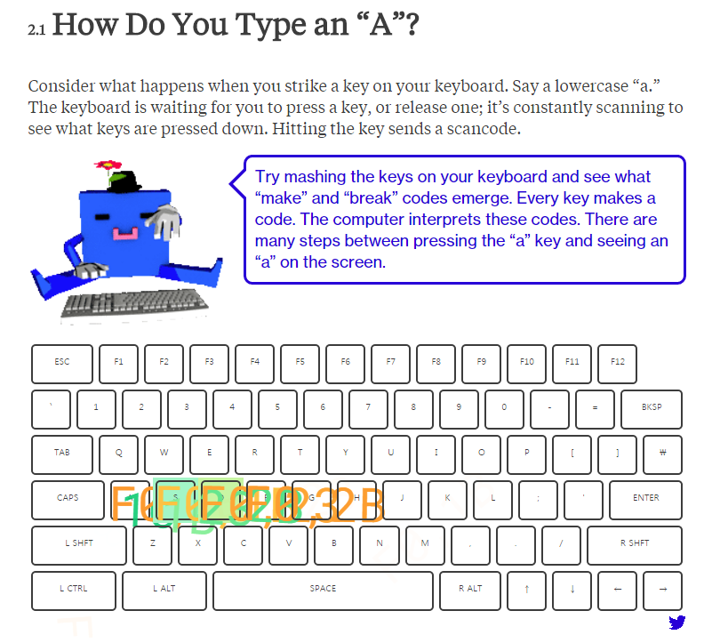

# whatiscode

- 페이지 링크: https://github.com/BloombergMedia/whatiscode

이번에 소개드릴 내용은 [블룸버그(Bloomberg)](http://www.bloomberg.com/)에 실린 [“What Is Code?”(원본페이지)](http://www.bloomberg.com/whatiscode)

라는 기고문입니다.   Paul Ford 라는 사람이 쓴 약 38,000 단어에 이르는 방대한 양의 글과 여러 그림들이 한 페이지에 있어서 로딩과 스크롤의 압박이 좀 있습니다;;

 이렇게 생긴 분입니다. Postlight사의 공동 설립자이고 현재 프로그래머이자 작가로 활동중이라고 하네요.

단순히 글만 있는 것이 아니라 아래 그림처럼 중간중간 재미있는 소스들이 많이 있습니다. 

키보드로 키를 입력하거나 화면을 마우스로 입력했을때 해당키에 효과가 나타납니다. 

읽다보면 흥미로운 내용들이 많이 있습니다. 가벼운 마음으로 읽어보....기엔 좀 깁니다...ㅠㅠ;;
  
 
## 목차
 1. The Man in the Taupe Blazer
 2. Let’s Begin
 3. Why Are Programmers So Intense About Languages?
 4. Why Are Coders Angry?
 5. The Time You Attended the E-mail Address Validation Meeting
 6. How Are Apps Made?
 7. The Triumph of Middle Management