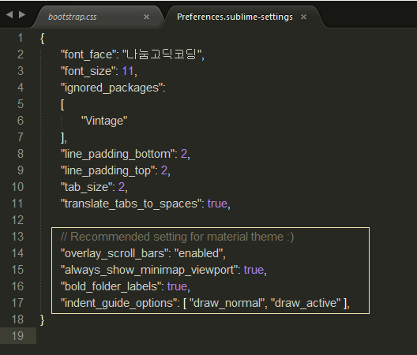

# material-theme

 - 페이지 링크: https://github.com/equinusocio/material-theme

구글의 material design에 어울리는 sublime text 3용 테마입니다.


설치는 매우 간편합니다. sublime text를 켜셔서, package control을 작동시키신 후 'material theme' 이라고 검색하시면 됩니다.


Preference에서 아래와 같이 UI 세팅을 하라고 개발자는 추천하고 있는데요

```json
"overlay_scroll_bars": "enabled",
"line_padding_top": 3,
"line_padding_bottom": 3,
"font_options": [ "gray_antialias" ], // On retina Mac
"always_show_minimap_viewport": true,
"bold_folder_labels": true,
"indent_guide_options": [ "draw_normal", "draw_active" ], // Highlight active indent
```

저는 아래와 같이 preference 설정을 해보았습니다.


Material design 느낌이 나는 색상들이 메인이여서 그런지 요소들이 더 명확하게 나타나네요.
테마 같은 것이야 말로 개인 취향이겠지만, 저는 마음에 들어서 바로 이 테마를 적용해서 이용중입니다. :)