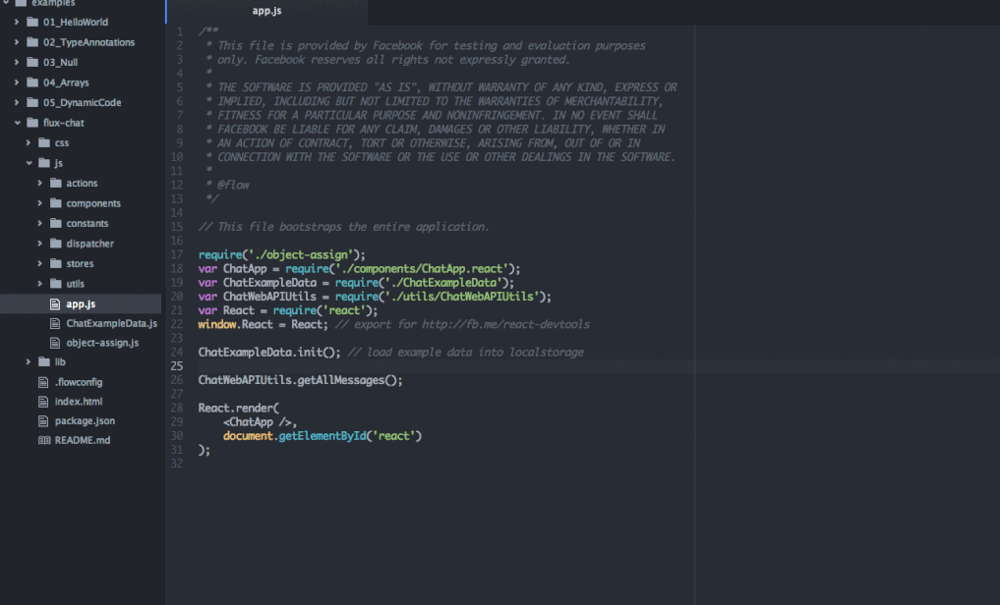

# nuclide

- 페이지 링크: https://github.com/facebook/nuclide

이번에 소개해드릴 깃헙 트랜드는 [nuclide](http://nuclide.io/)입니다. nuclide는 페이스북에서 선보인 것으로 모바일과 웹 개발을 위한 통합 IDE라고 합니다.

atom 1.0 버전이 출시되면서 이 프로젝트도 함께 트랜드에 올라온 것 같네요.

cmd에서 ```apm install nuclide-installer``` 명령 실행으로 간편하게 설치 할 수 있습니다.

Remote 기능과, javascript나 php hack 개발을 지원해주며, 특히 javascript의 경우엔 Flow기능을 사용 할 수 있다고 합니다.

 

```flow``` 설치 후 root에 ```.flowconfig``` 생성하고, js파일 상단에 ```/* @flow */``` 적어주시면 flow기능을 사용할 수 있습니다. 처음 eclipse에서 자바 개발에 익숙했던 저는 js개발할 때 이런 flow기능이 있으면 좋겠다고 많이 생각했었는데 저에게 맞춤형 기능이기에, 지금 개발하는 프로젝트부터  사용해봐야 할 것 같습니다.  
