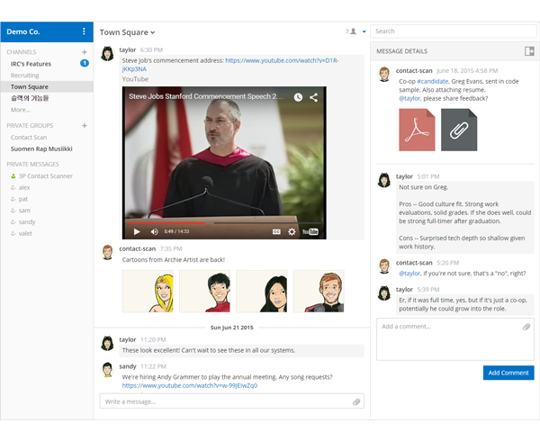

# platform

- 페이지 링크: https://github.com/mattermost/platform

이번 소개해드릴 프로젝트는 mattermost의 platform입니다. 그런데 이 프로젝트는 platform이라 부르기 보다는 [mattermost](http://www.mattermost.org/)불러야 할 거 같습니다.

이 프로젝트는 요즘 핫한 Slack을 대신 할 오픈소스라고 소개하고 있는데요. slack과 유사한 기능들을 제공해줘, slack 사용이 제한된 환경에서 설치해 내부적으로 사용할 수 있고, 오픈소스로 공개되었기 때문에 입맛에 맞게 변경해 사용할 수 있습니다.

react와 golang으로 개발되어 있으며, docker로 이미지가 제공되어 쉽게 설치할 수 있습니다.
slack과 유사한 오픈 소스를 찾는 분들이라면 한번 사용해보시길 추천드립니다.
