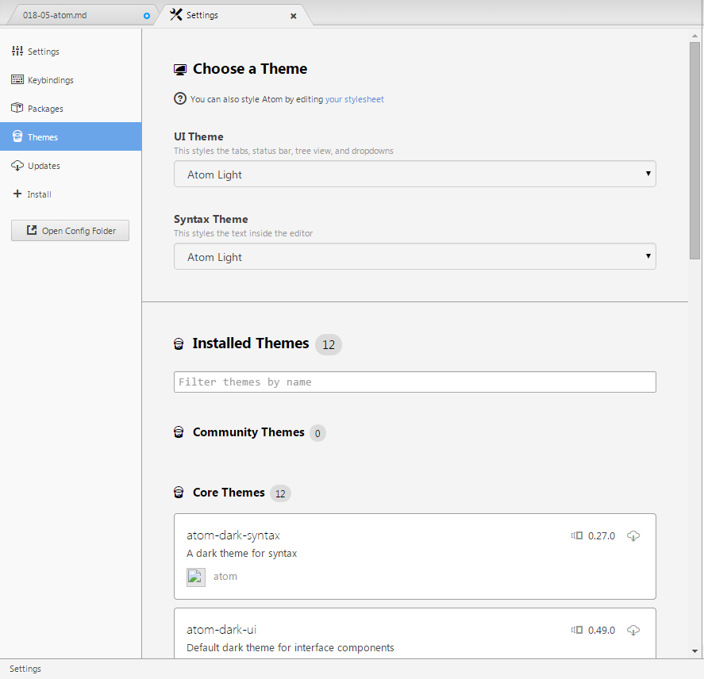
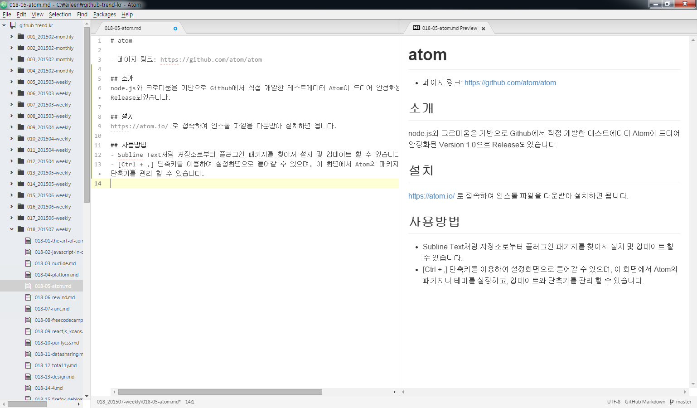

# atom

- 페이지 링크: https://github.com/atom/atom

## 소개
node.js와 크로미움을 기반으로 Github에서 직접 개발한 테스트에디터 Atom이 드디어 안정화된 Version 1.0으로 Release되었습니다.

## 설치
https://atom.io/ 로 접속하여 인스톨 파일을 다운받아 설치하면 됩니다.

## 사용방법
- Subline Text처럼 저장소로부터 플러그인 패키지를 찾아서 설치 및 업데이트 할 수 있습니다.

- [Ctrl + ,] 단축키를 이용하여 설정화면으로 들어갈 수 있으며, 이 화면에서 Atom의 패키지나 테마를 설정하고, 업데이트와 단축키를 관리 할 수 있습니다.

- Settings 화면

- 실제 Atom을 설치하여 사용해보았는데, 가장 마음에 들었던 기능은 Markdown preview 기능이었습니다.
Markdown문법에 익숙하지 않아도 텍스트파일을 편집하면서 바로 확인할 수 있으니 VERY GOOOOOOD!

