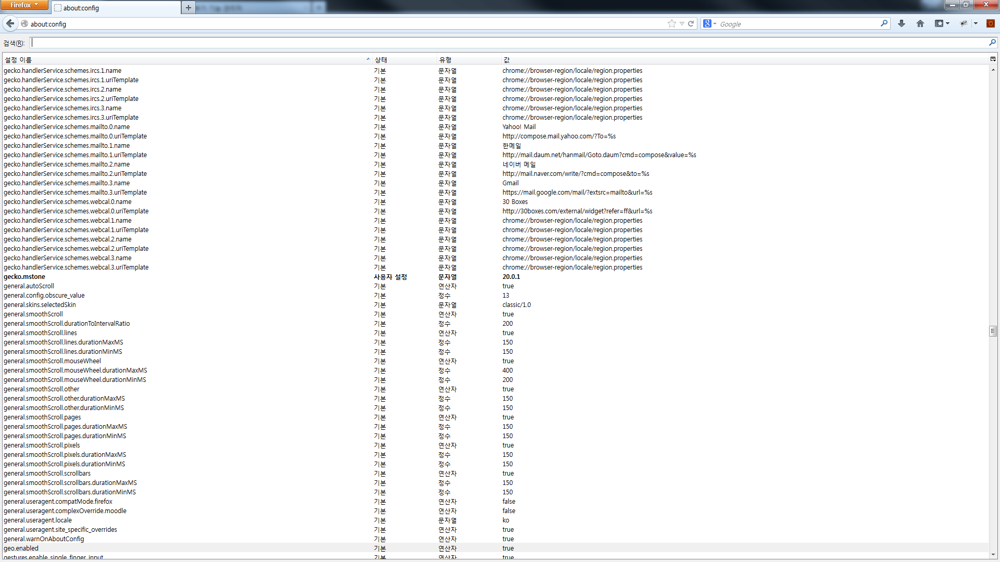

# firefox-debloat

- 페이지 링크: https://github.com/amq/firefox-debloat

이글을 제목 그대로 firefox의 부푼것(bloat)을 빼다(de)라는 의미로 Firefox 를 좀 가볍게 해주는 내용입니다.
파이어폭스를 사용 할 때 데이터의 유출이 많은  third-party services  와 관련된  core Firefox 기능들을 제거하는 방법입니다. 
쉽게 말하면 브러우져 사용  정보들을 서버로 날라가지 못하게 설정하는 것이라고 할수 있겠네요.

우선 파이어폭스 주소 창에 아래 처럼 입력하면
about:config

뭐가 설정들이 주르륵 나오네요. 신기신기
여기서 설정을 false 바꾸면됩니다.

근데 전 아래 설정들 중에 없는 부분들도 있네요.
저는 보면서 false로 설정해야하는구나 보다 이런정보들이 전송되고 있구나 등 파이어폭스 설정에 대해서 좀 더 아는 시간이였습니다.

- Google Safe Browsing

구글 브라우저 히스토리에 유출
 그러나 Safe Browsing 를 비활성화하면  악성 혹은 피싱사이트를 방문을 막지 못하는 위험에 노출 위험이 있다고 합니다.
    
    browser.safebrowsing.enabled
    browser.safebrowsing.downloads.enabled
    browser.safebrowsing.malware.enabled

- Firefox stats collecting
  
Stability and performance reports.

브러우저의 상태와 성능 등에 대한 데이터를 수집 [참고](https://www.mozilla.org/en-US/privacy/firefox/#health-report)

		datareporting.healthreport.service.enabled
		datareporting.healthreport.uploadEnabled

Usage statistics

UI 특성 메모리, 하드워어 설정에 따른 모질라 사용, 성능, 반응 상태 수집

	toolkit.telemetry.enabled

- Encrypted Media Extensions (DRM)

A binary plugin  은 Firefox since v38 부터 지원
암호화 미디어 재생하여 사용할 수 있음  Microsoft Silverlight 없이  Netflix  사용할 수 있음
이 플러그인 제거하면  Firefox. 빌드위에 n EME-free 를 설치해야함

		media.eme.enabled
		media.gmp-eme-adobe.enabled

- Firefox Hello

승인 요청없이 타 서버에 연결

    loop.enabled

- Pocket integration

아티클에 대한 읽기 목록을 관리 

    browser.pocket.enabled

- Search suggestions

검색박스에 타이핑하는 모든 글자가 서치 엔징에 보내짐.

    browser.search.suggest.enabled

- Geolocation

위치 정보검색

    geo.enabled

