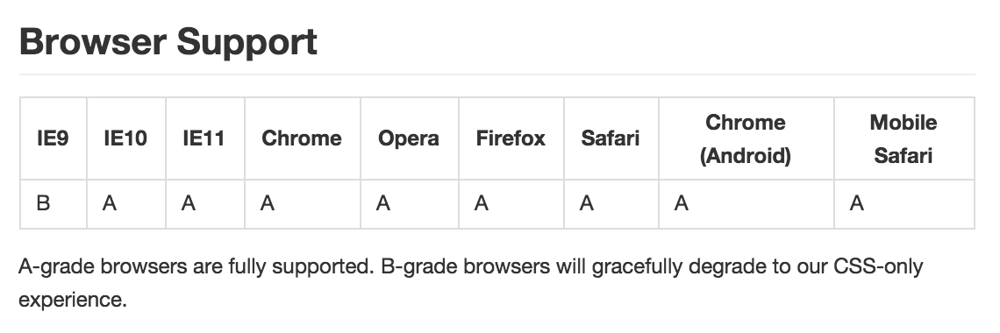

# material-design-lite

- 페이지 링크: https://github.com/google/material-design-lite

모바일 웹, 앱 디자인을 위해 Material Design을 제시했던 구글에서 드디어  [Material Design Lite](http://www.getmdl.io/)라는 UI라이브버리를 내놨습니다.
나오자 마자 11,000 여 개의 Star를 받으며 깃헙트랜드 1위로 올랐습니다.  

지원해주는 브라우져는 위 그림과 같고, 의외로 IE에서 사용할 수 있을 것이라 기대됩니다.

저는 간단한 웹사이트를 만들때 주로 [bootstrap](www.getbootstrap.com/) 이나 지난 13호에 소개해 드렸던 [Materialize](http://materializecss.com/) 를 주로 사용했습니다. 실제로 github trend kr 작성을 위한  [github-trend-kr-starter](http://teamsego.github.io/github-trend-kr-starter/)를 만들기 위해 Materialize를 이용해 만들고 있던 도중, material-design-lite가 나와서 이걸로 바꿔서 제작을 해봤습니다.

간단하게 이용해봐서 그런지 기존에 사용했던 것들과 큰 차이는 없는 것 같습니다.

다만 [grid](http://www.getmdl.io/components/index.html#layout-section/grid) 개념이 조금 다릅니다.
bootstrap의 경우 화면 크기와 관계 없이 row를 12등분 했고, 화면 크기에 따라 gird 크기를 조절하고 싶으면 화면 크기에 따른 class를 여러 개 지정했었습니다.
material-design-lite의 경우엔 기본적으로 desktop 12, tablet 8, mobile 4로 구분이 됩니다. bootstrap과 마찬가지로 화면 크기에 따라 클레스도 다르게 지정 할 수도 있습니다.

그리고 material Design은 보통 primary 색과 accent 색으로 구성이 되는데, 이를 [customize](http://www.getmdl.io/customize/index.html) 페이지에서 미리 비교해보고 css파일을 받을 수 있습니다.

조금의 수고로 Material Design view를 구성해보고 싶으시면, material-design-lite 꼭 한번 살펴보시기 바랍니다.
