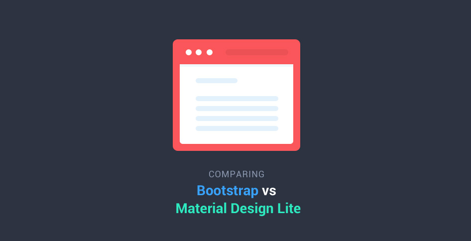

# bootstrap

- 페이지 링크: https://github.com/twbs/bootstrap

깃헙트렌드의 스테디셀러!! 트위터의 부트스트랩입니다.

이번 주에는 1위를 차지한 [Material Design Lite](http://www.getmdl.io/) 출시에 힘입어 덩달아 순위에 다시 오른 것 같네요.

Material Design Lite 출시 당일, [tutorialzine](http://tutorialzine.com/)에서는 Bootstrap과의 차이점을 비교한 Article([Comparing Bootstrap With Google's New Material Design Lite](http://tutorialzine.com/2015/07/comparing-bootstrap-with-mdl/))이 올라오기도 했습니다.

그만큼 사람들의 관심이 뜨겁다는 것이겠지요?

부트스트랩은 과연 앞으로 어떤 변화를 하게 될 지.. 점점 흥미진진하네요 :)

bootstrap의 README 한글화 페이지를 보고 싶다면, 지난 깃헙트렌드를 참조하세요.
- https://github.com/TeamSEGO/github-trend-kr/blob/master/005_201503-weekly/005-22_bootstrap.md
