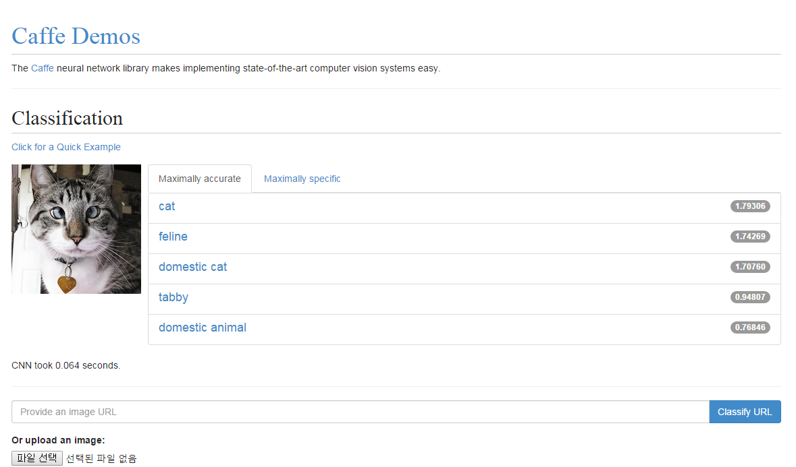
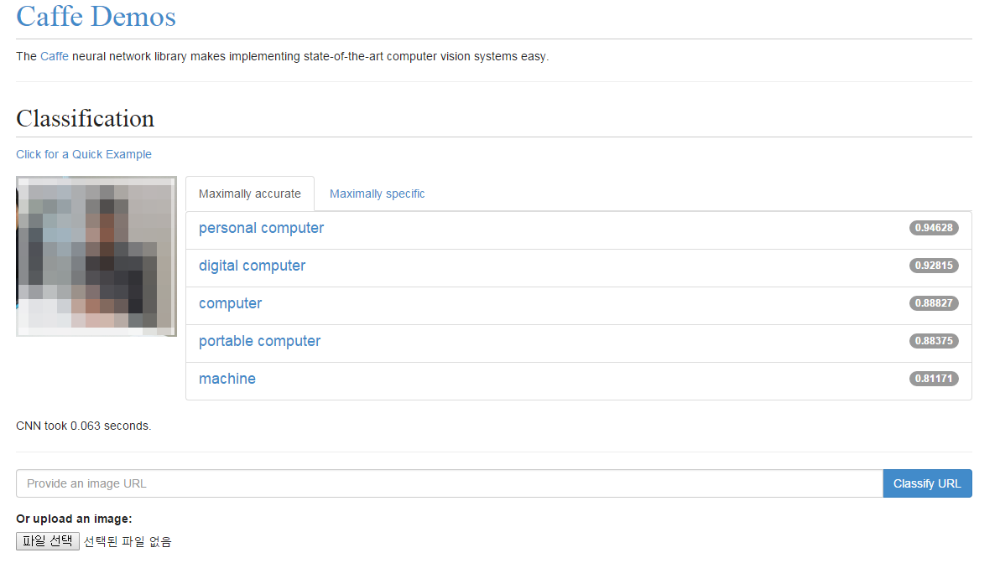

# caffe

- 페이지 링크: https://github.com/BVLC/caffe

이름이 참 맘에 드는 프로젝트입니다. Caffe는 버클리 비전 학습 센터(BVLC)에서 개발중인 딥러닝 프레임웍입니다.
사실 딥 러닝이라는 분야가 어떤 분야를 학습하는 건지에 대해서 프로젝트에는 크게 설명이 되어있지 않아서,
개발 공식 홈페이지(http://caffe.berkeleyvision.org/)를 찾아가 보았습니다.

데모가 있군요!!

이미지 URL이나 실제 이미지 파일을 업로드하면 해당 이미지와 관련된 정보를 추출해줍니다.
고양이나 개의 사진을 넣으면 'cat'이나 'dog'가 나오는 것처럼요. 제가 구글에서 검색한 이미지를 가지고
테스트를 해보니 강아지 사진을 넣으면 해당 강아지에 대한 견종까지도 결과를 보여주기도 했습니다.
제 관심분야이기도 한 카메라 모델 사진을 넣어보니 'camera'라는 정보까지는 추출하지만, 해당 사진을 보고
카메라의 모델명까지 알려주는 수준의 인식은 되지 않고 있네요.

딥러닝이니 차츰 결과의 정확도가 나아질거라 기대하는데.. 혹시나 하는 호기심에 저희 Team SEGO 팀원의 사진을
넣어보았는데요.

뭔가 결과가 제대로 나오지 않습니다. 'human'이 나와야 하는데 'machine'이라니;;;
다른 사람이 나온 사진, 제 사진도 넣어보았지만 사람에 대해서는 비전 인식이 안되는 것 같네요. 일부러 막아놓은게
아닌가 하는 추측이 듭니다. 사람이 아닌 대상에 대해서는 꽤 정확도 있게 어떤 물건인지를 알려줍니다.
혹시 비전인식과 관련해 코드가 필요하신 분들은 참고할 만한 프로젝트인 것 같습니다. 참고로 라이센스는 BSD-2입니다.
