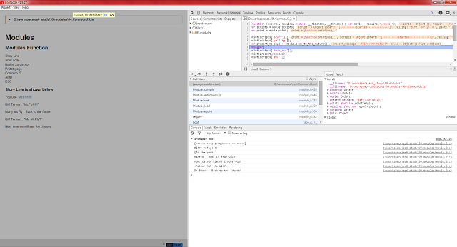

# iron-node

- 페이지 링크: https://github.com/s-a/iron-node

Node.js 개발 많이들 하시죠?

개발을 할때 가장 중요한 것 중에 하나가 디버거 일텐데요. Node 의 경우 Debugging 방법이 크게 알려지지 않은 게 사실입니다.

가장 많이 쓰이는 디버거는 어떤 게 있을까요?

제 경우는 [node-inspector](https://github.com/node-inspector/node-inspector)를 주로 사용했는데
debugger; 를 치느니 console.log를 많이 사용하는 습관이 몸에 익혀 있는 거 같습니다.

최근 Node 를 받아 설치해 보면 console.log 명령어로는 inspecting이 제대로 되지 않는 경우가 있는데
그런 경우는 디버거가 필수라고 생각이 됩니다.

node-inspector 의 경우는 실행 시키고 크롬 브라우저에서 그걸 inspecting 하는 방법을 사용했는데요

iron-node 의 경우는 명령어를 치면 바로 IDE 처럼 iron-node 가 떠서 debugger 포인트로 이동을 합니다.

어떻게 이게 가능해졌을까요?(난데없는 질문이군요!!!!!)

당연히 [electron](http://electron.atom.io/)으로 이게 가능해 졌습니다!(답정너군요!!!!!)

electron을 처음 봤을때 대단하게 많은 곳에서 사용하겠구나 생각했는데 이런 식으로도 쓰입니다.

자, 이게 debugging을 한번 해 봐야겠네요.

```
  var movie = require('./movie');
  var scripts = movie.scripts;
  var print = movie.print;

  print(scripts['start']);
  print(scripts['yelling']);
  var present_message =  movie.back_to_the_future();
debugger;
  print(scripts['back_scr']);
  print(present_message);
  print(scripts['end']);
```

처럼 debugger를 걸어주고

```
iron-node 04.CommonJS.js
```

실행을 했더니



와 같은 놀라운 실행화면을 볼 수 있습니다!

물론 크롬의 개발자 도구 처럼 손쉽게 다룰 수도 있습니다.
