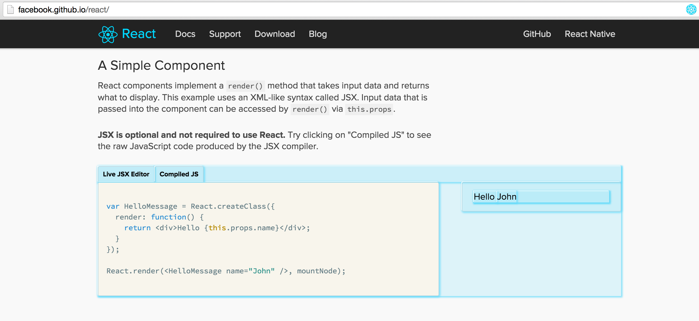

# show-me-the-react

- 페이지 링크: https://github.com/cymen/show-me-the-react

이번에 소개해 드릴 프로젝트는 web 화면에서 react 요소들을 보여주는 show me the react입니다.

이용해보시려면 크롬 확장프로그램인 show me the react를 설치하시면 됩니다.
설치 후에 react로 개발이 됬을 법한 웹으로 들어가봅니다. 저는 react를 배포 하고 있는 [http://facebook.github.io/react/](http://facebook.github.io/react/)에
접속하였는데요, react 컴포넌트가 있는 페이지로 이동하게 되면 크롬 주소창 옆에 react 로고가 뜹니다. 이 로고를 살며시 클릭하시면



위 그림과 같이 react 컴포넌트가 화면에 표시가 됩니다.

원리를 보면 react 컴포넌트에 부여되는 ```data-reactid```를 찾아 하이라이트를 주는 것입니다. 참 쉽죠!

show me the react 자체도 신선하고 재밌는 프로젝트였는데, 저는 페이스북 진영에서 개발하는 프로젝트들을 들어가보고 더 재밌는 것을 발견했습니다. 많은 부분은 react로 만들고 기존 만들었던 부분들을 대체 했을 것이라 생각했는데 그렇지 않았습니다. 반복적으로 재사용되는 요소들이 주로 react로 만들어져 있더라구요.

앞으로 react사용에 대해 어떻게 접근해야 할 지 개인적으로 생각하게 되었습니다. 여러분들도 한번 show me the react 도 이용해보시고, 잘 짜여진 react 사이트는 어떤 요소들을 react로 표현하는지 한번 보시기 바랍니다.   
