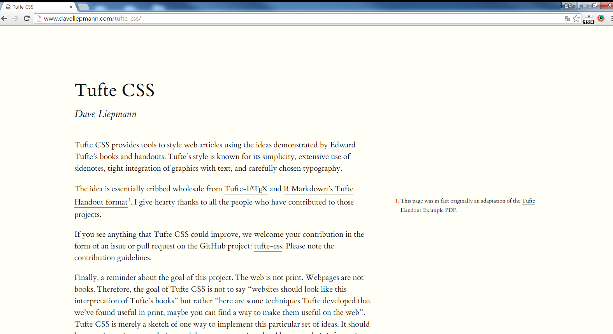

# tufte-css

- 페이지 링크: https://github.com/daveliepmann/tufte-css


Tufte CSS 는 Edward Tufte 라는 사람의 글씨체를 CSS 스타일을 만든거에요.
여기서 Edward Tufte 가  누구인지 궁금할 텐데요, 미국에서 저명한 통계학자로 예일대 교수라고 하네요.
좀더 자세한 설명은 [여기](https://en.wikipedia.org/wiki/Edward_Tufte)를 참고하세요

Edward Tufte 는  독특한 스타일의 인쇄물은 사용한다고 합니다.

간단하고, 잘 셋팅된 타이포그래피, 확장가능한 sidenotes. 그리고  그래픽과 차트의 타이트한 통합??
원문을 보겠습니다.
simple, with well-set typography, extensive sidenotes, and tight integration of graphics and charts.

 tufte-css 는 이 스타일을  HTML 문서로 만들어 준것이구요
이 프로젝트는 Tufte-LaTeX 와 R Markdown Tufte Handout 에서 영감을 받았다고 하네요.


그럼 일단 도대체 Tufte CSS 이 몬지 잠시 볼까요?
http://www.daveliepmann.com/tufte-css/  페이지에서 볼수 있는데요.




보니 사람의 손편지 글씨체 같네요.


이걸 적용하는 방법은 매~우 간단합니다. ```tufte.css```, ```ETBembo-RomanLF.ttf```, and ```ETBembo-DisplayItalic.ttf``` 만 다운 받아서 적용하시면됩니다.

 			   <link rel="stylesheet" href="tufte.css"/>

물론 이 프로젝트를 clone 해서 index 페이지를 열어도 되구요.
