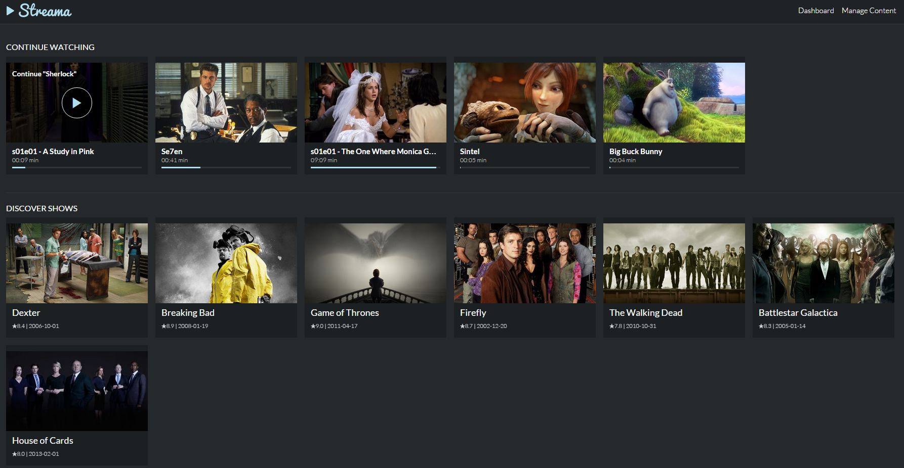

# streama

- 페이지 링크: https://github.com/dularion/streama

## 소개

[Streama](http://dularion.github.io/streama/)는 한마디로 나만의 동영상 책장을 만들어주는 프로젝트입니다.

기업문화로 유명한 [넷플릭스-Netflix](https://www.netflix.com/kr/) 의 서비스에서 영감을 얻었다고 하는군요

백문이불여일견!

아래처럼 본인이 가지고있는 동영상을 페이지에 정리할 수 있습니다.

CONTINUE WATCHING 부분은 끝까지 보지 않은 영상의 경우 이어보기를 하도록 정리하고 있는 것을 볼 수 있습니다.

재밌는 점은 다른 유저가 내 동영상 책장에 접속하여 동영상 리스트를 공유할 수 있고,

LIVE WATCHING이 가능하여 서로 다른 장소에 있는 유저가 동시에 같은 장면을 볼 수도 있습니다.

## 설치
1. jdk 1.7 이상 설치
2. ``git clone https://github.com/dularion/streama.git``
3. mySQL 설치

이렇게만 하면 기본적인 설치 준비가 끝납니다. 물론 기본 설정해주는 부분이 남아있긴 합니다만 그리 복잡하지 않습니다.

자세한 설치 방법은 [이 곳](http://dularion.github.io/streama/#easy-setup)을 참고하세요.

## 동영상 업로드 & 재생

## 에피소드 넘기기

## LIVE WATCHING

